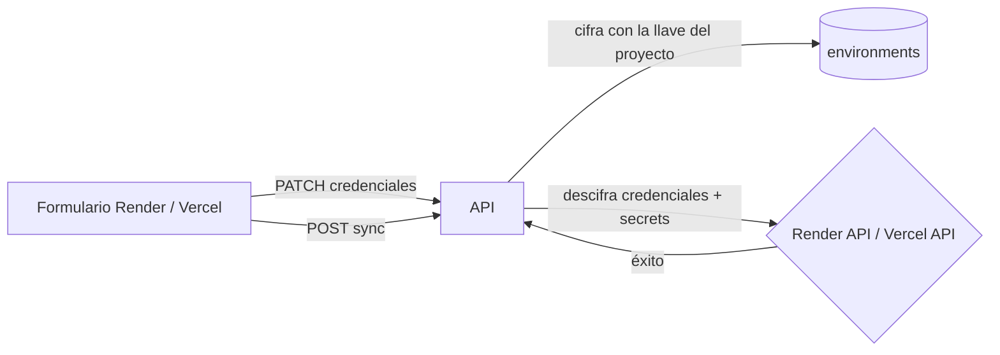

# Recorrido guiado: sincronización con Render y Vercel

Guion para presentar el subsistema abriendo los archivos en orden. Cada paso es
una línea con su enlace: haces clic, muestras, explicas.

- [render.yaml](render.yaml) → config real del deploy en Render (tiene su propio link a la doc oficial).
- **Este** → para explicarlo en voz alta.
- Ver también [README_RECORRIDO_VPC.md](README_RECORRIDO_VPC.md) → cómo se despliega la API que corre este código.

---

## El sistema en 30 segundos

> Cada `Environment` puede guardar credenciales opcionales de Render y/o
> Vercel — un service id/token por proveedor. "Sincronizar" es tomar los
> secretos ya guardados (y cifrados) en Mongo y empujarlos como variables de
> entorno al servicio externo, vía su API REST.
>
> Las credenciales de Render/Vercel se cifran con la **misma llave de
> proyecto** que los secretos normales — no hay un segundo sistema de
> cifrado para esto.



| | Proveedor | Semántica del sync | Endpoint |
|---|---|---|---|
| 🟪 | **Render** | `PUT` — reemplaza el arreglo completo de env vars | `/v1/sync/render/{project_id}/{slug}/` |
| ⬛ | **Vercel** | `POST ?upsert=true` — solo toca lo que manda, borrado es opt-in | `/v1/sync/vercel/{project_id}/{slug}/` |

---

# 🔐 Flujo 1 — Guardar credenciales (común a ambos proveedores)

**Ejemplo:** un admin pega el Service ID y el API Key de Render en el formulario.

| # | Qué pasa | Archivo |
|---|----------|---------|
| 1 | El formulario llama al hook de contexto al enviar | [RenderSyncForm.tsx:23](../tek-secrets-app/components/V2/Forms/RenderSyncForm.tsx#L23) · [VercelSyncForm.tsx:28](../tek-secrets-app/components/V2/Forms/VercelSyncForm.tsx#L28) |
| 2 | El contexto llama al cliente API | [RenderActionsContext.tsx:108](../tek-secrets-app/context/RenderActionsContext.tsx#L108) · [VercelActionsContext.tsx:140](../tek-secrets-app/context/VercelActionsContext.tsx#L140) |
| 3 | `PATCH` con las credenciales en el body | [api.ts:763](../tek-secrets-app/lib/api.ts#L763) (Render) · [api.ts:809](../tek-secrets-app/lib/api.ts#L809) (Vercel) |
| 4 | El endpoint delega al servicio de actualización | [environments.py:102](api/app/api/v1/endpoints/environments.py#L102) (Render) · [environments.py:122](api/app/api/v1/endpoints/environments.py#L122) (Vercel) |
| 5 | Se cifra **cada campo** con la llave activa del proyecto antes de guardar | [environment.py:204](api/app/services/environment.py#L204) `_encrypt_single_fields`, llamado desde [:234](api/app/services/environment.py#L234) y [:278](api/app/services/environment.py#L278) |
| 6 | `$set` parcial en el mismo documento `environment` — no hay colección aparte | [environment.py:217](api/app/services/environment.py#L217) (Render) · [:262](api/app/services/environment.py#L262) (Vercel) |

### Las 2 cosas que explicar aquí

**Por qué la misma llave del proyecto y no un cifrado aparte.** El manager de
llaves (`get_key_manager`) y el flujo de rotación ya existen para los
secretos normales. Reusarlo para `render_token`/`vercel_token` significa que
rotar la llave del proyecto rota también estas credenciales, sin un segundo
sistema que mantener.

**Por qué `exclude_unset` en el update.** El usuario puede mandar solo el
campo que cambió — por ejemplo, actualizar solo el `target` de Vercel sin
reenviar (y sin arriesgar pisar) el token ya guardado.

---

# 🟪 Flujo 2 — Sincronizar con Render

| # | Qué pasa | Archivo |
|---|----------|---------|
| 1 | Click en "Sincronizar" | [RenderSyncForm.tsx:23](../tek-secrets-app/components/V2/Forms/RenderSyncForm.tsx#L23) |
| 2 | El contexto llama al cliente API | [RenderActionsContext.tsx:134](../tek-secrets-app/context/RenderActionsContext.tsx#L134) |
| 3 | `POST /v1/sync/render/{project_id}/{slug}` | [api.ts:776](../tek-secrets-app/lib/api.ts#L776) |
| 4 | El endpoint valida que el usuario sea admin del proyecto y delega | [render.py:16](api/app/api/v1/endpoints/render.py#L16) |
| 5 | El servicio busca el ambiente y las credenciales de Render | [render.py:17](api/app/services/render.py#L17) → `get_environment_by_slug` / `get_render_info` ([environment.py:94](api/app/services/environment.py#L94)) |
| 6 | `PUT` a Render con **todos** los secretos como `[{key, value}, ...]` | [render.py:46](api/app/services/render.py#L46) |

### Las 2 cosas que explicar aquí

**Por qué `PUT` y no un upsert incremental.** El endpoint `env-vars` de
Render reemplaza el arreglo completo — si una key existente en Render no va
en el payload, Render la borra. Por eso no hay opción de "no tocar lo
demás": cada sync a Render es total, siempre.

**Sin concepto de target.** A diferencia de Vercel, Render no distingue
production/preview/development por variable — el payload es más simple
porque no hace falta preguntarle nada al usuario antes de sincronizar.

---

# ⬛ Flujo 3 — Sincronizar con Vercel

**Antes de sincronizar:** Vercel exige un `target` explícito por variable
(`production`, `preview`, `development`). La UI se lo pide al proyecto en
vez de al usuario:

| # | Qué pasa | Archivo |
|---|----------|---------|
| 1 | `GET /v1/vercel/{project_id}/{slug}/targets` | [api.ts:859](../tek-secrets-app/lib/api.ts#L859) → [vercel.py:85](api/app/api/v1/endpoints/vercel.py#L85) |
| 2 | Se infiere el target leyendo la **primera env var ya cargada** en el proyecto Vercel | [vercel.py:204](api/app/services/vercel.py#L204) `get_targets_from_project` → `fetch_project_from_vercel` ([:18](api/app/services/vercel.py#L18)) |
| 3 | Si el proyecto en Vercel todavía no tiene ninguna env var, no hay de dónde inferir → se devuelven los targets default de Vercel en vez de tratarlo como "proyecto no encontrado" | [vercel.py:15](api/app/services/vercel.py#L15) `DEFAULT_VERCEL_TARGETS` |

**El sync en sí:**

| # | Qué pasa | Archivo |
|---|----------|---------|
| 4 | Click en "Sincronizar" con el target elegido | [VercelSyncForm.tsx:28](../tek-secrets-app/components/V2/Forms/VercelSyncForm.tsx#L28) |
| 5 | `POST /v1/sync/vercel/{project_id}/{slug}/?remove_missing_secrets&target_name` | [VercelActionsContext.tsx:171](../tek-secrets-app/context/VercelActionsContext.tsx#L171) → [api.ts:821](../tek-secrets-app/lib/api.ts#L821) |
| 6 | El endpoint valida admin y delega | [vercel.py:20](api/app/api/v1/endpoints/vercel.py#L20) |
| 7 | `POST {…}/env?upsert=true` con `[{key, value, type: "encrypted", target: [...]}]` | [vercel.py:79](api/app/services/vercel.py#L79) → [:133](api/app/services/vercel.py#L133) |
| 8 | Si `remove_missing=true`: se listan las env vars existentes y se borran una por una las que ya no están en la BD | [vercel.py:150](api/app/services/vercel.py#L150) → `fetch_existing_vercel_envs` ([:49](api/app/services/vercel.py#L49)), `delete_vercel_env_var` ([:60](api/app/services/vercel.py#L60)) |
| 9 | Tras el sync, se persiste el target usado en el ambiente | [vercel.py:48](api/app/api/v1/endpoints/vercel.py#L48) → `update_environment_vercel_target` ([environment.py:308](api/app/services/environment.py#L308)) |

### Las 3 cosas que explicar aquí

**`upsert=true` vs. el `PUT` total de Render.** Vercel sí permite mandar solo
lo que cambió sin tocar el resto. Por eso "borrar lo que sobra" es opcional
y explícito (`remove_missing_secrets`), y requiere **dos llamadas** — listar
existentes y luego borrar key por key — porque la API de Vercel no ofrece un
"set exacto" en un solo request como Render.

**Sin rollback.** Si el `POST` (paso 7) tiene éxito pero el loop de `DELETE`
(paso 8) falla a mitad de camino, algunas keys sobrantes quedan borradas y
otras no. No hay transacción que lo revierta.

**Por qué existe el endpoint de targets.** Sin él, el usuario tendría que
adivinar si en Vercel guardó las variables como `production` o `preview`.
Leyendo lo que ya hay cargado se lo mostramos en vez de preguntárselo.

---

# 🔍 Flujo 4 — Detectar drift sin sincronizar (solo Vercel)

| # | Qué pasa | Archivo |
|---|----------|---------|
| 1 | `GET /v1/vercel/{project_id}/{slug}/mismatches` | [vercel.py:64](api/app/api/v1/endpoints/vercel.py#L64) |
| 2 | Compara las keys que ya existen en Vercel contra las locales; devuelve las que sobran allá | [vercel.py:166](api/app/services/vercel.py#L166) `secrets_mismatch` |

Solo existe para Vercel. Render no lo necesita: como cada sync es un `PUT`
total (Flujo 2), no hay estado intermedio que "mostrar" — sincronizar ya
iguala todo de una.

---

# Demo en vivo

```bash
# 1. Guardar credenciales de un ambiente (UI) → ver el PATCH en la pestaña Network
# 2. Sincronizar con Render → ver el PUT completo en Network, todas las keys presentes
# 3. Sincronizar con Vercel eligiendo target → ver el POST con upsert=true
# 4. Borrar una key solo de la BD, sincronizar con Vercel con "eliminar sobrantes" activado
#    → esa key debería desaparecer también de Vercel
```

---

# Preguntas probables

**¿Qué pasa si el token es inválido?** `httpx.HTTPStatusError` se relanza
como `Exception` genérica; el endpoint atrapa cualquier excepción y devuelve
500 con el texto crudo que respondió el proveedor — útil para depurar, pero
es detalle interno filtrándose al cliente.

**¿Y si dos personas sincronizan a la vez?** No hay lock. Gana el último
`PUT`/`POST` que llegue.

**¿Queda auditado cada sync?** Sí — `_sync_to_render` y `_sync_to_vercel`
están decorados con `create_service_logger`, el mismo pipeline del
[recorrido de logs](logs/README_RECORRIDO.md): cada sync (éxito o fallo)
deja fila en la tabla de auditoría.

**¿Por qué Render no tiene `mismatches` ni `remove_missing` opcional?** Por
el `PUT` total del Flujo 2 — no hay estado a medias que mostrar ni que
preservar.

---

# Chuleta

| Qué | Render | Vercel |
|---|---|---|
| Guardar credenciales | [environments.py:102](api/app/api/v1/endpoints/environments.py#L102) | [environments.py:122](api/app/api/v1/endpoints/environments.py#L122) |
| Cifrado de credenciales | [environment.py:204](api/app/services/environment.py#L204) | [environment.py:204](api/app/services/environment.py#L204) |
| Sync — endpoint | [render.py:16](api/app/api/v1/endpoints/render.py#L16) | [vercel.py:20](api/app/api/v1/endpoints/vercel.py#L20) |
| Sync — servicio | [render.py:46](api/app/services/render.py#L46) | [vercel.py:112](api/app/services/vercel.py#L112) |
| Semántica | `PUT` total | `POST upsert=true` |
| Drift / mismatches | — | [vercel.py:166](api/app/services/vercel.py#L166) |
| Targets | — | [vercel.py:204](api/app/services/vercel.py#L204) |
| URL base (config) | [config.py:33](api/app/core/config.py#L33) `RENDER_API_URL` | [config.py:34](api/app/core/config.py#L34) `VERCEL_API_URL` |
| Doc oficial de la API | [Render API — env vars](https://api-docs.render.com/reference/update-environment-variables-for-service) | [Vercel API — env vars](https://vercel.com/docs/rest-api/reference/endpoints/projects/create-one-or-more-environment-variables) |
