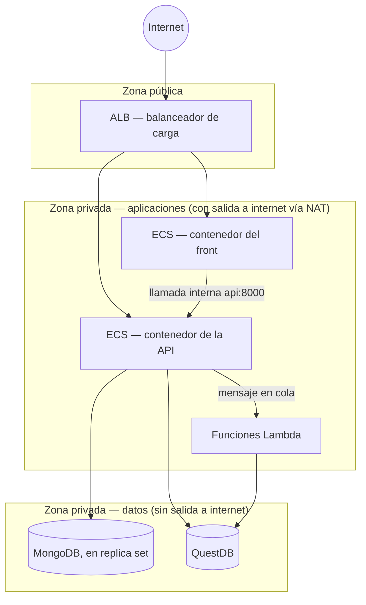

# Recorrido guiado de la infraestructura (`vpc_v2`)

Guion para presentar la infraestructura de AWS (Amazon Web Services) abriendo
los archivos en orden. Cada paso de las tablas trae su enlace: haces clic,
muestras el código, explicas con tus palabras el párrafo de arriba.

- [vpc_v2/README.md](vpc_v2/README.md) → runbook operativo completo: qué
  revisar después de correr `apply`, cuánto cuesta tenerlo prendido, qué
  sobrevive a un `destroy` y qué no.
- **Este documento** → para explicarlo en voz alta, en el mismo orden en que
  Terraform lo va construyendo.
- Ver también [README_RECORRIDO_SYNC.md](README_RECORRIDO_SYNC.md) → la
  aplicación (Render y Vercel) que corre *encima* de esta infraestructura,
  no dentro de ella.

---

## Glosario rápido

Los nombres técnicos de AWS aparecen abreviados en el código y en las
conversaciones del día a día. Acá está el nombre completo de cada uno, para
no tener que adivinar sobre la marcha:

| Sigla | Nombre completo | En una frase |
|---|---|---|
| **VPC** | Virtual Private Cloud (nube privada virtual) | La red aislada, propia del proyecto, donde vive todo lo demás. |
| **AZ** | Availability Zone (zona de disponibilidad) | Un centro de datos físicamente separado dentro de la misma región. Duplicar en 2 AZs es lo que evita que un apagón en un solo edificio tire todo el sistema. |
| **IGW** | Internet Gateway (puerta de enlace a internet) | La puerta de entrada/salida de la red hacia internet. |
| **NAT** (Gateway) | Network Address Translation | Deja que algo salga a internet sin que internet pueda entrar directo a eso. |
| **ALB** | Application Load Balancer (balanceador de carga de aplicación) | El único punto de entrada público; reparte el tráfico entrante hacia los servicios correctos. |
| **ECS** | Elastic Container Service (servicio de contenedores) | El orquestador que corre los contenedores Docker de la API y del front. |
| **ECR** | Elastic Container Registry (registro de contenedores) | Donde se guardan las imágenes Docker, en vez de traerlas de Docker Hub. |
| **EC2** | Elastic Compute Cloud (servidor virtual) | Una máquina virtual normal — acá se usa para MongoDB y QuestDB. |
| **AMI** | Amazon Machine Image (imagen de máquina) | La plantilla desde la que arranca una EC2 — acá, una con Docker ya instalado. |
| **EBS** | Elastic Block Store (disco de bloque) | El disco duro virtual que se le pega a una EC2. |
| **IAM** | Identity and Access Management (gestión de identidad y permisos) | Quién (o qué recurso) puede hacer qué dentro de la cuenta de AWS. |
| **SQS** | Simple Queue Service (servicio de colas de mensajes) | La cola de mensajes que desacopla a quien escribe un evento de quien lo procesa. |
| **DLQ** | Dead Letter Queue (cola de mensajes fallidos) | Donde cae un mensaje que falló varias veces, para no perderlo ni bloquear a los demás. |
| **ACM** | AWS Certificate Manager (gestor de certificados) | Emite y renueva el certificado que habilita HTTPS. |
| **DNS** | Domain Name System (sistema de nombres de dominio) | Traduce un nombre (`api.secretsapi.online`) a la dirección real del servidor. |
| **OIDC** | OpenID Connect | El protocolo que deja a GitHub Actions autenticarse ante AWS sin guardar una contraseña. |
| **SSM** | Systems Manager | El servicio de AWS que permite entrar a una EC2 por consola, sin necesidad de SSH ni de IP pública. |

---

## El sistema, en 30 segundos

Todo lo que hace falta para tener el sistema corriendo — la red, la
seguridad, las imágenes de Docker, las bases de datos, las colas, las
funciones, el balanceador, los contenedores y hasta el despliegue automático
— se crea con un solo comando: `terraform apply`. No siempre fue así: en la
versión original (`vpc/`), varios de estos pasos eran scripts sueltos que
había que correr *antes* del `apply`, y que después obligaban a pegar
valores a mano dentro de `terraform.tfvars` — la receta clásica para que
algo dependa de otra cosa que todavía no existe. Acá ese problema
desaparece: alcanza con correr `terraform apply` de nuevo para reconstruir o
actualizar cualquier parte del sistema.



Y la misma red, pero subred por subred — con sus CIDRs, sus zonas de
disponibilidad y qué corre en cada una (diagrama tomado de la arquitectura
completa del objetivo 5):

```
Usuario/Browser          GoDaddy DNS (secretsapi.online)
      │                  app./api. → CNAME ALB · apex → forwarding a app.
      └──────────────────────────┬─────────────────────────────────────
                                  ▼
                          [Internet Gateway]
                                  │
                                  ▼
┌──────────────────────────────────── VPC 10.0.0.0/16 ────────────────────────────────────────┐
│                                                                                               │
│  ┌────────── Subred Pública A ──────────┐  ┌────────── Subred Pública B ──────────┐          │
│  │  10.0.1.0/24  (us-east-1a)           │  │  10.0.2.0/24  (us-east-1b)           │          │
│  │  ┌──────────────────────────────┐    │  │  ┌──────────────────────────────┐    │          │
│  │  │  ALB (nodo A)                │    │  │  │  ALB (nodo B)                │    │          │
│  │  │  HTTPS:443 · ACM *.secretsapi│    │  │  │  .online (wildcard)          │    │          │
│  │  │  host app.* → tg-front       │    │  │  │  host api.* → tg-api         │    │          │
│  │  └──────────────────────────────┘    │  │  └──────────────────────────────┘    │          │
│  │  ┌─────────────┐                     │  │                                      │          │
│  │  │  NAT Gateway│                     │  │                                      │          │
│  │  └─────────────┘                     │  │                                      │          │
│  └──────────────────────────────────────┘  └──────────────────────────────────────┘          │
│                 ▲  (solo apps→internet)                                                       │
│  ┌────────── Subred Privada Apps A ─────┐  ┌────────── Subred Privada Apps B ─────┐          │
│  │  10.0.3.0/24  (us-east-1a)           │  │  10.0.4.0/24  (us-east-1b)           │          │
│  │  Ruta: 0.0.0.0/0 → NAT Gateway       │  │  Ruta: 0.0.0.0/0 → NAT Gateway       │          │
│  │  ┌──────────────────────────────┐    │  │  ┌──────────────────────────────┐    │          │
│  │  │  ECS Fargate Task (API)      │    │  │  │  ECS Fargate Task (API)      │    │          │
│  │  │  FastAPI :8000               │    │  │  │  FastAPI :8000               │    │          │
│  │  └──────────────▲───────────────┘    │  │  └──────────────▲───────────────┘    │          │
│  │         Service Connect (api:8000)   │  │         Service Connect (api:8000)   │          │
│  │                 │ interno, sin ALB   │  │                 │ interno, sin ALB   │          │
│  │  ┌──────────────┴───────────────┐    │  │  ┌──────────────┴───────────────┐    │          │
│  │  │  ECS Fargate Task (Front)    │    │  │  │  ECS Fargate Task (Front)    │    │          │
│  │  │  Next.js SSR :3000           │    │  │  │  Next.js SSR :3000           │    │          │
│  │  └──────────────────────────────┘    │  │  └──────────────────────────────┘    │          │
│  │  ┌──────────────────────────────┐    │  │  ┌──────────────────────────────┐    │          │
│  │  │  Lambda (logs-consumer)      │    │  │  │  Lambda (rotation-worker)    │    │          │
│  │  │  Lambda (rotation-master)    │    │  │  │                              │    │          │
│  │  └──────────────────────────────┘    │  │  ┌──────────────────────────────┐    │          │
│  │                                      │  │  │  MongoDB Arbiter (Docker)    │    │          │
│  │                                      │  │  │  :27017  (solo vota)         │    │          │
│  │                                      │  │  └──────────────────────────────┘    │          │
│  └──────────────────────────────────────┘  └──────────────────────────────────────┘          │
│                                                                                               │
│  ┌────────── Subred Privada Data A ─────┐  ┌────────── Subred Privada Data B ─────┐          │
│  │  10.0.5.0/24  (us-east-1a)           │  │  10.0.6.0/24  (us-east-1b)           │          │
│  │  Ruta: SIN internet (solo S3 GW)     │  │  Ruta: SIN internet (solo S3 GW)     │          │
│  │  ┌──────────────────────────────┐    │  │  ┌──────────────────────────────┐    │          │
│  │  │  EC2 — QuestDB Primary       │    │  │  │  EC2 — QuestDB Standby       │    │          │
│  │  │  (Docker) :9000 :8812        │    │  │  │  (Docker, STOPPED)           │    │          │
│  │  │  IP fija: 10.0.5.20          │    │  │  │  IP fija: 10.0.6.20          │    │          │
│  │  └──────────────────────────────┘    │  │  └──────────────────────────────┘    │          │
│  │  ┌──────────────────────────────┐    │  │  ┌──────────────────────────────┐    │          │
│  │  │  MongoDB Primary (Docker)    │    │  │  │  MongoDB Secondary (Docker)  │    │          │
│  │  │  :27017  priority=2          │◄───┼──┼──┤  :27017  priority=1          │    │          │
│  │  │  IP fija: 10.0.5.10          │    │  │  │  IP fija: 10.0.6.10          │    │          │
│  │  └──────────────────────────────┘    │  │  └──────────────────────────────┘    │          │
│  └──────────────────────────────────────┘  └──────────────────────────────────────┘          │
│           │  ▲ replicación RS (TCP 27017)              ▲                                      │
│           └──────────────── Arbiter vota ──────────────┘                                     │
│                                                                                               │
│  ┌──────────────────────────────────────────────────────────────────────────────────────┐    │
│  │  ECR · SQS · Secrets Manager · CloudWatch (VPC Interface Endpoints)                  │    │
│  │  SSM · SSMMessages · EC2Messages (VPC Interface Endpoints — acceso admin sin SSH)    │    │
│  │  S3 (VPC Gateway Endpoint — capas ECR + backups)                                    │    │
│  └──────────────────────────────────────────────────────────────────────────────────────┘    │
└───────────────────────────────────────────────────────────────────────────────────────────────┘
```

La idea central es simple: **tres zonas de red, cada una con menos acceso
que la anterior.** La zona pública solo tiene el balanceador. La zona de
aplicaciones tiene los contenedores y las funciones, que sí necesitan salir
a internet (para hablar con GitHub, con Vercel, con Render). Y la zona de
datos — donde viven MongoDB y QuestDB — no tiene ninguna salida a internet:
si algo ahí adentro se ve comprometido, no tiene por dónde filtrar
información hacia afuera.

Terraform construye todo esto en el orden en que están numerados los
archivos:

| Grupo | Qué construye | Archivos |
|---|---|---|
| 0 | Los proveedores de Terraform (conexión con AWS) | `00-providers.tf` |
| 1 | La red — la VPC y sus tres zonas, en 2 zonas de disponibilidad | `01-network.tf` |
| 2 | La seguridad — reglas de tráfico y permisos | `02-security.tf`, `02-iam.tf` |
| 3 | Las imágenes — registro de contenedores, imagen de máquina, copiado de imágenes | `03-*.tf` |
| 4 | Las bases de datos, los secretos, las colas, el balanceador, los contenedores, las funciones y el despliegue automático | `04-*.tf` |
| 5 | Las copias de seguridad | `05-backup.tf` |

---

# 🌐 Flujo 1 — La red

La red se organiza en **tres zonas (tiers), repetidas en 2 zonas de
disponibilidad (AZ)** para que un problema en un solo centro de datos no
tire todo el sistema. El propio archivo lo resume así:

```
zona pública          -> tiene salida a internet directa (balanceador, NAT Gateway)
zona de aplicaciones  -> sale a internet a través del NAT Gateway (contenedores, funciones)
zona de datos         -> no tiene ninguna ruta a internet (bases de datos)
```

| # | Qué pasa | Archivo |
|---|----------|---------|
| 1 | Se crea la red privada (VPC) | [01-network.tf:10](vpc_v2/terraform/01-network.tf#L10) |
| 2 | Subredes públicas, una por zona de disponibilidad | [01-network.tf:18](vpc_v2/terraform/01-network.tf#L18) |
| 3 | Subredes privadas para las aplicaciones, una por zona de disponibilidad | [01-network.tf:36](vpc_v2/terraform/01-network.tf#L36) |
| 4 | Subredes privadas para los datos, sin salida a internet, una por zona de disponibilidad | [01-network.tf:52](vpc_v2/terraform/01-network.tf#L52) |
| 5 | La puerta de entrada a internet (Internet Gateway) y la puerta de salida controlada (NAT Gateway) | [01-network.tf:68](vpc_v2/terraform/01-network.tf#L68) |
| 6 | Las tablas de ruteo, una por zona | [01-network.tf:89](vpc_v2/terraform/01-network.tf#L89) |

**Por qué la zona de datos no tiene salida a internet.** MongoDB y QuestDB
nunca necesitan iniciar una conexión hacia afuera — solo responder a lo que
les pregunta la API, que vive en la misma red. Quitarles la ruta de salida
es una capa extra de seguridad: si alguna de esas instancias se viera
comprometida, no tendría por dónde enviar datos hacia fuera. Esta misma
decisión es la que obliga a que exista el copiado de imágenes del Flujo 3:
si esas instancias no llegan a internet, tampoco pueden bajar su propia
imagen de Docker Hub.

---

# 🔒 Flujo 2 — Seguridad y permisos

Antes de crear ningún servidor, se define quién puede hablar con quién (los
grupos de seguridad) y quién puede hacer qué dentro de la cuenta de AWS (los
roles de IAM (Identity and Access Management)).

| # | Qué pasa | Archivo |
|---|----------|---------|
| 1 | Un grupo de seguridad por componente: balanceador, contenedores, QuestDB, MongoDB, funciones, puntos de conexión privados | [02-security.tf:24](vpc_v2/terraform/02-security.tf#L24) |
| 2 | Reglas explícitas, una por cada combinación de dirección y servicio — nunca "permitir todo" entre zonas | [02-security.tf:74](vpc_v2/terraform/02-security.tf#L74) |
| 3 | El rol de **ejecución** de los contenedores (baja la imagen y lee los secretos antes de arrancar) | [02-iam.tf:21](vpc_v2/terraform/02-iam.tf#L21) |
| 4 | El rol de **tarea** de los contenedores (los permisos que ve el código ya corriendo, como escribir en la cola) | [02-iam.tf:52](vpc_v2/terraform/02-iam.tf#L52) |
| 5 | Los roles de las funciones Lambda (la que consume logs, y las de rotación) | [02-iam.tf:86](vpc_v2/terraform/02-iam.tf#L86) |
| 6 | El rol de las máquinas de datos, limitado a acceso por consola (sin llave SSH) | [02-iam.tf:213](vpc_v2/terraform/02-iam.tf#L213) |

**Por qué hay dos roles distintos para un mismo contenedor.** El rol de
**ejecución** es el que usa AWS *antes* de que el código empiece a correr:
bajar la imagen de Docker, leer los secretos. El rol de **tarea** es el que
usa el código *una vez que ya está corriendo*: por ejemplo, escribir un
mensaje en la cola. Separarlos aplica el mismo principio de "el mínimo
permiso necesario" que ya se aplica a nivel de usuario, pero ahora a nivel
del propio motor de contenedores.

---

# 📦 Flujo 3 — Las imágenes de Docker

Las máquinas de datos (Flujo 4) no tienen salida a internet, así que Docker
y las imágenes de MongoDB/QuestDB necesitan llegar por un camino distinto al
habitual.

| # | Qué pasa | Archivo |
|---|----------|---------|
| 1 | Los repositorios del registro de contenedores (ECR): api, front, questdb, mongodb, cada uno con su política de limpieza automática | [03-ecr.tf:12](vpc_v2/terraform/03-ecr.tf#L12) |
| 2 | La imagen de máquina (AMI) con Docker ya instalado, construida dentro del mismo `apply` | [03-ami.tf:16](vpc_v2/terraform/03-ami.tf#L16) |
| 3 | Un único inicio de sesión contra el registro de contenedores, del que dependen las dos copias siguientes | [03-mirror.tf:17](vpc_v2/terraform/03-mirror.tf#L17) |
| 4 | Copiado de las imágenes de QuestDB y MongoDB desde Docker Hub hacia el registro propio, en paralelo | [03-mirror.tf:30](vpc_v2/terraform/03-mirror.tf#L30) |
| 5 | Puntos de conexión privados hacia los servicios de AWS (registro de contenedores, almacenamiento, colas, secretos, logs, consola) — para que la zona privada les hable sin pasar por el NAT Gateway | [03-endpoints.tf:11](vpc_v2/terraform/03-endpoints.tf#L11) |

**Por qué un solo inicio de sesión, compartido.** El copiado de la imagen de
QuestDB y el de MongoDB corren en paralelo, y ambos necesitan iniciar sesión
contra el mismo registro. Si cada uno lo hiciera por su cuenta, dos inicios
de sesión simultáneos escribiendo la misma credencial local chocan con un
error de "ya existe". Hacerlo una sola vez, y que los otros dos dependan de
ese paso, elimina esa carrera por completo —
[03-mirror.tf:1](vpc_v2/terraform/03-mirror.tf#L1).

**Por qué la imagen de máquina se construye dentro del `apply`, y no
antes.** Antes era un script aparte que corría primero, y que después
obligaba a copiar el identificador de la imagen a mano dentro de
`terraform.tfvars` — una dependencia circular con algo que todavía se
estaba creando. Ahora ese paso vive dentro del mismo `apply`: primero se
construye la imagen si hace falta, y después se la vuelve a leer como
cualquier otro dato, todo dentro del mismo grafo de dependencias de
Terraform — [03-ami.tf:1](vpc_v2/terraform/03-ami.tf#L1).

---

# 🗄️ Flujo 4 — Las bases de datos

| # | Qué pasa | Archivo |
|---|----------|---------|
| 1 | El archivo de clave compartida del conjunto de réplicas de MongoDB | [03-ec2-mongodb.tf:14](vpc_v2/terraform/03-ec2-mongodb.tf#L14) |
| 2 | El nodo primario (zona de disponibilidad A) | [03-ec2-mongodb.tf:19](vpc_v2/terraform/03-ec2-mongodb.tf#L19) |
| 3 | El nodo secundario (zona de disponibilidad B) | [03-ec2-mongodb.tf:85](vpc_v2/terraform/03-ec2-mongodb.tf#L85) |
| 4 | El árbitro — solo vota en una elección, no guarda datos | [03-ec2-mongodb.tf:146](vpc_v2/terraform/03-ec2-mongodb.tf#L146) |
| 5 | El servidor principal de QuestDB, con su propio disco (EBS) | [03-ec2-questdb.tf:8](vpc_v2/terraform/03-ec2-questdb.tf#L8) |
| 6 | Un servidor de respaldo de QuestDB, apagado por defecto | [03-ec2-questdb.tf:70](vpc_v2/terraform/03-ec2-questdb.tf#L70) |

**Por qué un árbitro, y no un tercer servidor con datos.** Un conjunto de
réplicas de MongoDB necesita un número impar de votos para decidir, sin
ambigüedad, quién es el nodo primario si hay un problema de conexión. El
árbitro aporta ese tercer voto sin el costo de mantener un tercer servidor
con disco completo — solo participa en la votación, nunca guarda un dato.

Para el detalle de qué se instala dentro de cada máquina (el script de
arranque, la creación de tablas, por qué se usa `ALTER` en vez de
`CREATE`), eso ya lo cubre el
[recorrido del subsistema de logs](logs/README_RECORRIDO.md#-flujo-5--la-infraestructura)
a ese nivel de detalle.

---

# 🔑 Flujo 5 — Secretos, colas de mensajes y funciones

| # | Qué pasa | Archivo |
|---|----------|---------|
| 1 | Secretos que Terraform **genera solo**, sin intervención humana: la llave de la aplicación, la llave maestra de cifrado, el secreto de autenticación del front | [04-secrets.tf:15](vpc_v2/terraform/04-secrets.tf#L15) |
| 2 | Secretos que son **entradas** — quedan como un valor de relleno (`CHANGEME_...`) hasta que alguien los edita a mano: el identificador y la clave de la aplicación OAuth de GitHub | [04-secrets.tf:67](vpc_v2/terraform/04-secrets.tf#L67) |
| 3 | La cola de mensajes de logs, con su cola de mensajes fallidos (DLQ) | [04-sqs.tf:5](vpc_v2/terraform/04-sqs.tf#L5) |
| 4 | La cola de mensajes de rotación, con su cola de mensajes fallidos | [04-sqs.tf:25](vpc_v2/terraform/04-sqs.tf#L25) |
| 5 | Una alarma que avisa si algo cae en una cola de mensajes fallidos | [04-sqs.tf:46](vpc_v2/terraform/04-sqs.tf#L46) |
| 6 | La función que consume los mensajes de logs | [04-lambda.tf:46](vpc_v2/terraform/04-lambda.tf#L46) |
| 7 | Las funciones de rotación (una que coordina, otra que ejecuta) y el horario automático que las dispara | [04-lambda.tf:90](vpc_v2/terraform/04-lambda.tf#L90), [:169](vpc_v2/terraform/04-lambda.tf#L169) |

**Generados por Terraform, o pegados a mano — en el mismo archivo, y por una
razón concreta.** La llave de la aplicación y la llave maestra de cifrado no
necesitan que ningún humano las lea nunca: Terraform las genera al azar y
ahí termina su historia. El identificador y la clave de la aplicación OAuth
de GitHub, en cambio, dependen de algo que existe *fuera* de AWS — una
aplicación creada a mano en GitHub — así que Terraform no puede inventarlos:
quedan como relleno hasta que alguien los copia dentro de
`terraform.tfvars` y corre `apply` de nuevo. El detalle completo de qué
falta configurar está en
[vpc_v2/README.md § Qué NO va a funcionar todavía](vpc_v2/README.md#qué-no-va-a-funcionar-todavía).

---

# 🚪 Flujo 6 — La puerta de entrada: balanceador, certificado y contenedores

| # | Qué pasa | Archivo |
|---|----------|---------|
| 1 | El certificado (ACM) y su validación por DNS | [04-acm.tf:16](vpc_v2/terraform/04-acm.tf#L16) |
| 2 | El balanceador de carga (ALB) — el único punto de entrada desde internet | [04-alb.tf:7](vpc_v2/terraform/04-alb.tf#L7) |
| 3 | El reparto de tráfico según el dominio: `app.<dominio>` va al front, `api.<dominio>` va a la API | [04-alb.tf:94](vpc_v2/terraform/04-alb.tf#L94) |
| 4 | La construcción y publicación de la imagen de la API, dentro del mismo `apply` | [04-api-image.tf:18](vpc_v2/terraform/04-api-image.tf#L18) |
| 5 | El clúster de contenedores (ECS) y su espacio de nombres interno | [04-ecs.tf:9](vpc_v2/terraform/04-ecs.tf#L9), [:29](vpc_v2/terraform/04-ecs.tf#L29) |
| 6 | El contenedor de la API, que se anuncia internamente como `api:8000` | [04-ecs.tf:74](vpc_v2/terraform/04-ecs.tf#L74), [:170](vpc_v2/terraform/04-ecs.tf#L170) |
| 7 | El contenedor del front, que **consume** ese `api:8000` sin anunciar nada propio | [04-ecs.tf:272](vpc_v2/terraform/04-ecs.tf#L272), [:380](vpc_v2/terraform/04-ecs.tf#L380) |
| 8 | El escalado automático según uso de procesador (CPU) | [04-ecs.tf:433](vpc_v2/terraform/04-ecs.tf#L433) |

**Cómo se hablan el front y la API sin salir de la red.** En vez de armar un
segundo balanceador solo para tráfico interno, el front le habla a la API
directamente como `http://api:8000`. Esto lo resuelve "Service Connect": un
descubrimiento de servicios interno de AWS que no necesita configurarse como
un DNS (Domain Name System) privado tradicional — cada contenedor trae, por
dentro, un pequeño proxy que ECS (Elastic Container Service) le inyecta
solo, y es ese proxy el que sabe a quién enrutar.
Es más simple y más barato que duplicar el balanceador.

**Los contenedores arrancan endurecidos por defecto.** El sistema de
archivos es de solo lectura, corren con un usuario sin privilegios
(identificador 1000, nunca como administrador/root) y no tienen ningún
permiso de sistema operativo de más. Los secretos les llegan a través del
gestor de secretos de AWS, nunca como una variable de entorno visible en la
definición de la tarea.

**Un bug real que ya quedó resuelto:** en algún momento, los contenedores
fallaban con el error "no tiene un balanceador de carga asociado". La causa
era que el servicio dependía del grupo de destino del balanceador, pero no
de la *regla del listener* que realmente conecta ese grupo con el tráfico
entrante — sin esa regla, el balanceador no sabía a quién mandar las
peticiones. La lista completa de bugs ya resueltos está en
[vpc_v2/README.md § 10.3](vpc_v2/README.md#103-bugs-reales-que-ya-están-arreglados-en-el-código-no-deberían-volver-a-aparecer).

---

# 🔁 Flujo 7 — Despliegue automático sin contraseñas guardadas

| # | Qué pasa | Archivo |
|---|----------|---------|
| 1 | El proveedor de identidad de GitHub Actions dentro de AWS (protocolo OpenID Connect, OIDC) | [04-github-oidc.tf:10](vpc_v2/terraform/04-github-oidc.tf#L10) |
| 2 | El rol que GitHub Actions puede asumir, limitado a la rama `main` del repositorio del front | [04-github-oidc.tf:20](vpc_v2/terraform/04-github-oidc.tf#L20) |
| 3 | El permiso para publicar una imagen nueva en el registro de contenedores | [04-github-oidc.tf:44](vpc_v2/terraform/04-github-oidc.tf#L44) |
| 4 | El permiso para actualizar el servicio del front en ECS | [04-github-oidc.tf:75](vpc_v2/terraform/04-github-oidc.tf#L75) |

**No hay ninguna credencial de larga duración guardada en GitHub.** En vez
de eso, GitHub Actions le presenta a AWS un token temporal, firmado por
GitHub, que demuestra de qué repositorio y de qué rama viene la ejecución.
El rol solo confía en ese token si viene exactamente del repositorio y la
rama configurados (`main`) — un flujo de trabajo corriendo desde un fork o
desde otra rama no puede asumir el rol, aunque tenga el mismo código.

---

# 💾 Flujo 8 — Copias de seguridad

| # | Qué pasa | Archivo |
|---|----------|---------|
| 1 | El depósito y el plan de copias de seguridad (AWS Backup) | [05-backup.tf:15](vpc_v2/terraform/05-backup.tf#L15), [:22](vpc_v2/terraform/05-backup.tf#L22) |
| 2 | Qué discos entran en ese plan: los de MongoDB y QuestDB | [05-backup.tf:66](vpc_v2/terraform/05-backup.tf#L66) |
| 3 | Una alarma que avisa si una copia de seguridad falla | [05-backup.tf:80](vpc_v2/terraform/05-backup.tf#L80) |

---

# Demo en vivo

```bash
cd tek-secrets/vpc_v2/terraform
terraform output   # nombre del balanceador, IDs de instancias, colas, funciones — todo sale de acá
```

**1. La API responde**
```bash
ALB=$(terraform output -raw alb_dns_name)
curl http://$ALB/health
```

**2. Documentación interactiva (Swagger)** → abrir en el navegador
`http://<alb_dns_name>/docs`

**3. Estado del conjunto de réplicas de MongoDB, sin necesidad de SSH**
(usa Systems Manager para abrir una sesión de consola directo a la instancia)
```bash
MONGO_ID=$(terraform output -raw mongodb_primary_instance_id)
aws ssm start-session --target "$MONGO_ID"
```

**4. QuestDB, con un túnel de puerto, sin abrir nada al público**
```bash
QUESTDB_ID=$(terraform output -raw questdb_primary_instance_id)
aws ssm start-session --target "$QUESTDB_ID" \
  --document-name AWS-StartPortForwardingSession \
  --parameters '{"portNumber":["9000"],"localPortNumber":["9000"]}'
```

El runbook completo, paso a paso desde cero — incluyendo la configuración de
DNS (Domain Name System) y del certificado en GoDaddy — está en
[vpc_v2/README.md § 10.2](vpc_v2/README.md#102-runbook-completo--de-cero-a-andando).

---

# Preguntas probables

**¿Cuánto cuesta tenerlo prendido?** Entre 280 y 300 dólares al mes con cero
tráfico. Los servidores, el NAT (Network Address Translation) Gateway, el
balanceador, los contenedores y
los 7 puntos de conexión privados cobran por hora, tengan uso o no. Por eso
se recomienda apagarlo con `terraform destroy` cuando no se está usando, y
levantarlo de nuevo con el runbook cuando haga falta — ver
[vpc_v2/README.md § 10.5](vpc_v2/README.md#105-costo--apagar-cuando-no-se-usa).

**¿Qué sobrevive a un `destroy`, y qué no?** Sobreviven la aplicación OAuth
de GitHub, los secretos guardados en GitHub Actions y todo el código ya
subido al repositorio. NO sobreviven el nombre del balanceador, el
certificado (hay que repetir su validación por DNS (Domain Name System) en
GoDaddy) ni los datos
de MongoDB y QuestDB — el diseño asume que cada vez que se levanta de nuevo
es un ambiente completamente nuevo. El detalle completo está en
[vpc_v2/README.md § 10.1](vpc_v2/README.md#101-qué-sobrevive-a-un-destroy-y-qué-no).

**¿Por qué todo en un solo `apply`, y no un proceso en varios pasos?**
Porque la versión anterior tenía justo el problema opuesto: la imagen de
máquina, el copiado de imágenes, la publicación de la API y los secretos
eran pasos previos hechos con scripts sueltos, con valores que había que
copiar a mano de un paso al siguiente. Juntar todo en un solo grafo de
dependencias de Terraform elimina esa clase entera de error humano.

---

# Chuleta

| Qué | Archivo |
|---|---|
| Red y subredes por zona | [01-network.tf:10](vpc_v2/terraform/01-network.tf#L10) |
| Grupos de seguridad | [02-security.tf:24](vpc_v2/terraform/02-security.tf#L24) |
| Rol de ejecución vs. rol de tarea (contenedores) | [02-iam.tf:21](vpc_v2/terraform/02-iam.tf#L21) / [:52](vpc_v2/terraform/02-iam.tf#L52) |
| Imagen de máquina con Docker, dentro del `apply` | [03-ami.tf:16](vpc_v2/terraform/03-ami.tf#L16) |
| Copiado de imágenes al registro propio (con inicio de sesión compartido) | [03-mirror.tf:17](vpc_v2/terraform/03-mirror.tf#L17) |
| MongoDB en conjunto de réplicas (primario/secundario/árbitro) | [03-ec2-mongodb.tf:19](vpc_v2/terraform/03-ec2-mongodb.tf#L19) |
| QuestDB (con servidor de respaldo apagado) | [03-ec2-questdb.tf:8](vpc_v2/terraform/03-ec2-questdb.tf#L8) |
| Secretos generados solos vs. secretos a completar a mano | [04-secrets.tf:15](vpc_v2/terraform/04-secrets.tf#L15) / [:67](vpc_v2/terraform/04-secrets.tf#L67) |
| Colas de mensajes, con su cola de fallidos | [04-sqs.tf:5](vpc_v2/terraform/04-sqs.tf#L5) |
| Balanceador de carga y reparto por dominio | [04-alb.tf:7](vpc_v2/terraform/04-alb.tf#L7) / [:94](vpc_v2/terraform/04-alb.tf#L94) |
| Comunicación interna front → API | [04-ecs.tf:29](vpc_v2/terraform/04-ecs.tf#L29) / [:170](vpc_v2/terraform/04-ecs.tf#L170) |
| Despliegue automático sin contraseñas guardadas (GitHub + OIDC) | [04-github-oidc.tf:10](vpc_v2/terraform/04-github-oidc.tf#L10) |
| Copias de seguridad | [05-backup.tf:15](vpc_v2/terraform/05-backup.tf#L15) |
| Runbook operativo completo | [vpc_v2/README.md](vpc_v2/README.md) |
