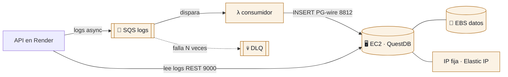

# Infraestructura de Logs (QuestDB) — Terraform

Módulo **independiente** que provisiona en AWS todo lo necesario para el logging
con **QuestDB**. No comparte estado ni recursos con el módulo de rotación
(`../rotation`): cada uno tiene su propio `terraform/` y su propio estado.



**Flujo de escritura de logs:** la API **no** escribe directo en QuestDB; encola el
log en SQS (async, no bloquea la petición). Una **Lambda consumidora** se dispara
con los mensajes de la cola y hace el `INSERT` en la tabla `Logs` de QuestDB por el
protocolo Postgres-wire (8812). La API sí **lee** los logs por REST (9000).

## Qué crea

| Recurso | Función |
|---------|---------|
| **EC2** (Amazon Linux 2023) | Corre QuestDB en Docker (`user_data`) |
| **EBS (gp3)** | Volumen persistente para los datos de logs |
| **Elastic IP** | IP pública **fija** → va en `EC2_INSTANCE_IP` de la API |
| **Security Group** | Abre 9000 (REST/web) y 8812 (PG); 9009 (ILP) cerrado. Un CIDR por puerto, ver "Acceso por puerto" |
| **SQS + DLQ** | Ingesta asíncrona de logs |
| **Lambda consumidora** | Lee SQS y hace `INSERT` en la tabla `Logs` (PG-wire 8812) |

## Estructura

```
logs/
├── README.md
├── .gitignore
├── lambda/
│   └── consumer/
│       ├── handler.py        # SQS -> INSERT en QuestDB (PG-wire)
│       └── requirements.txt  # pg8000
├── terraform/
│   ├── main.tf               # EC2, EBS, EIP, SG, SQS
│   ├── consumer.tf           # Lambda consumidora + IAM + event source mapping
│   ├── variables.tf
│   ├── outputs.tf
│   └── terraform.tfvars.example
└── scripts/
    ├── questdb_userdata.sh   # instala Docker + arranca QuestDB + crea tablas
    └── build_consumer.sh     # empaqueta la Lambda consumidora (zip)
```

## Uso

```bash
cd tek-secrets/logs

# 1. Empaquetar la Lambda consumidora (genera terraform/lambda_consumer.zip)
./scripts/build_consumer.sh

# 2. Aplicar Terraform
cd terraform
cp terraform.tfvars.example terraform.tfvars   # editar valores
terraform init
terraform apply
```

> El `apply` necesita el zip. Corre `build_consumer.sh` **antes** de `terraform apply`
> (y de nuevo si cambias `handler.py`).

Al terminar:

```bash
terraform output questdb_public_ip     # → EC2_INSTANCE_IP de la API
terraform output questdb_web_console   # http://<ip>:9000
terraform output logs_sqs_queue_url    # → SQS_QUEUE_URL de la API
```

Luego, en las variables de entorno de la API (Render), apunta:
```
EC2_INSTANCE_IP   = <questdb_public_ip>
EC2_INSTANCE_PORT = 9000
SQS_QUEUE_URL     = <logs_sqs_queue_url>
```

## Lambda consumidora (SQS → QuestDB)

`terraform/consumer.tf` despliega una Lambda (`handler.py`, runtime `python3.12`)
disparada por la cola SQS de logs. Por cada mensaje hace `INSERT` en la tabla `Logs`
de QuestDB usando **pg8000** por el puerto **8812** (Postgres-wire), conectándose a
la **Elastic IP** de la EC2.

- **Lotes + reintentos:** procesa hasta `consumer_batch_size` mensajes por
  invocación. Usa `ReportBatchItemFailures`: solo los mensajes que fallan vuelven a
  la cola (tras `sqs_max_receive_count` reintentos van a la DLQ).
- **Credenciales QuestDB:** por defecto `admin` / `quest` / db `qdb`
  (`questdb_pg_*` en las variables).
- ⚠️ **Red:** la Lambda corre **fuera de VPC**, así que sale por IPs públicas
  dinámicas de AWS y llega a QuestDB por su **IP pública**. Por eso el 8812 tiene su
  propia variable, `lambda_cidr`, y se queda en `0.0.0.0/0`: si lo restringes a la IP
  de la API, **la Lambda dejaría de conectar** (habría que meterla en la VPC con NAT —
  fuera del alcance de este módulo).

## Acceso por puerto (Security Group)

Los tres puertos tienen consumidores distintos, así que cada uno lleva su propia
variable. **No se pueden restringir por igual.**

| Puerto | Variable | Quién lo usa | Estado |
|--------|----------|--------------|--------|
| 9000 REST/consola | `api_cidr` | La API (lee logs, escribe `encryption_key_audit`) y tú desde el navegador | ⚠️ **abierto a internet** |
| 8812 Postgres-wire | `lambda_cidr` | Solo la Lambda consumidora | abierto (obligado, ver arriba) |
| 9009 ILP | `enable_ilp` | Nadie | cerrado (`false`) |

### ⚠️ Pendiente: cerrar el 9000

QuestDB OSS **no autentica el puerto 9000** — el RBAC es feature de Enterprise. Con
`api_cidr = ["0.0.0.0/0"]`, cualquiera en internet puede abrir la consola web, leer
la tabla `Logs` completa (user ids, acciones, target ids, paths) y ejecutar SQL
arbitrario, `DROP TABLE` incluido. El CIDR es la única barrera que hay.

Para cerrarlo hacen falta dos datos:

1. **IPs de egress de Render** — dashboard → tu servicio → *Connect* → *Outbound IPs*
2. **Tu IP pública** — `curl ifconfig.me` (para poder entrar a la consola)

Y luego, en `terraform.tfvars`:

```hcl
api_cidr = [
  "A.B.C.D/32",   # egress Render #1
  "A.B.C.E/32",   # egress Render #2
  "TU.IP.PUB/32", # tu máquina, para la consola web
]
```

```bash
terraform apply    # solo modifica el Security Group: no recrea la EC2 ni pierde datos
```

> Si el ISP te rota la IP pública, pierdes el acceso a la consola hasta reaplicar
> con la nueva. Las IPs de egress estáticas de Render requieren plan de pago.

## Tablas de QuestDB (DDL)

Una QuestDB fresca arranca **vacía**. El `user_data` crea automáticamente las tablas
que usa la app (idempotente, `CREATE TABLE IF NOT EXISTS`). Si necesitas correrlas a
mano (consola web en `:9000` o `/exec`):

```sql
-- Logs HTTP / de servicio (escritos vía SQS → consumidor → QuestDB)
CREATE TABLE IF NOT EXISTS Logs (
  date TIMESTAMP, user STRING, action STRING, targetType STRING,
  idTarget STRING, details STRING, execution_time DOUBLE
) TIMESTAMP(date) PARTITION BY DAY;

-- Auditoría de rotación de llaves (INSERT directo desde la API)
CREATE TABLE IF NOT EXISTS encryption_key_audit (
  timestamp TIMESTAMP, action STRING, key_id STRING, project_id STRING,
  actor_id STRING, ip_address STRING, operation_result STRING, details STRING
) TIMESTAMP(timestamp) PARTITION BY DAY;
```

> `encryption_key_audit` **debe existir** antes de rotar (la API le hace `INSERT`
> directo; QuestDB no auto-crea tablas con `INSERT`, solo con ILP).

## Autodescubrimiento desde la API (sin poner la IP a mano)

La API descubre la IP de QuestDB **sola**, al arrancar: busca en AWS la instancia
EC2 con tag `Name = tek-secrets-questdb` (la que crea este módulo) y toma su IP
pública. Implementado en `api/app/core/config.py` (`_discover_questdb_ip`).

- Si `EC2_INSTANCE_IP` **está** en las env vars de la API → esa tiene prioridad.
- Si **no está** → se autodescubre desde AWS. Así, aunque destruyas y recrees la
  QuestDB (IP nueva), la API la vuelve a encontrar al reiniciar, sin cambios manuales.

**Requisitos:**
- La API ya usa `boto3` y credenciales AWS (las de SQS). El usuario de esas
  credenciales necesita el permiso IAM **`ec2:DescribeInstances`**.
- El nombre del tag es configurable con la env var `QUESTDB_INSTANCE_NAME`
  (default `tek-secrets-questdb`).

## ⚠️ A diferencia de la rotación (serverless)

- **Con estado y siempre encendido:** la EC2 factura 24/7 (es el costo real de este
  módulo, a diferencia de la rotación que cuesta centavos).
- **Cuidado con `terraform destroy`:** elimina la EC2. Los datos sobreviven solo si
  el volumen EBS no se borra; considera *snapshots* (backup) antes de destruir.
- **Restringe el acceso:** ver "Acceso por puerto" abajo. Cada puerto tiene su
  propia variable; no se pueden restringir por igual.

## Ciclo de vida: parar / eliminar / recrear

Gracias al **volumen EBS** (datos persistentes) y al **autodescubrimiento** de la
API, puedes apagar, borrar y recrear la QuestDB sin romper nada.

### Parar (pausar) — deja de facturar cómputo, conserva los datos

```bash
cd tek-secrets/logs/terraform
ID=$(terraform output -raw questdb_instance_id)

aws ec2 stop-instances  --instance-ids "$ID"   # pausar
aws ec2 start-instances --instance-ids "$ID"   # reanudar
```

- La **Elastic IP no se libera** → al reanudar la IP es **la misma**; la API no
  necesita re-descubrir nada.
- Parada solo pagas el EBS (y la EIP mientras no esté asociada a instancia encendida).

### Eliminar todo

```bash
# (opcional) snapshot del EBS antes de borrar, para no perder los logs históricos
cd tek-secrets/logs/terraform
VOL=$(terraform state show aws_ebs_volume.questdb_data | grep -m1 'id ' | awk '{print $3}' | tr -d '"')
aws ec2 create-snapshot --volume-id "$VOL" --description "questdb-logs backup"

terraform destroy      # ⚠️ borra EC2 + EBS (los datos se pierden sin snapshot)
```

### Recrear

```bash
cd tek-secrets/logs
./scripts/build_consumer.sh          # regenera el zip de la Lambda
cd terraform
terraform apply                      # levanta todo de cero; user_data recrea las tablas
```

- El `user_data` recrea las tablas (`CREATE TABLE IF NOT EXISTS`) y la Lambda
  consumidora queda apuntando a la EIP nueva (Terraform lo cablea).
- La EIP es **nueva** → **reinicia la API** para que autodescubra la IP:
  ```bash
  cd tek-secrets/api && .venv/bin/fastapi dev app/main.py
  ```

## Migrar la QuestDB existente (recomendado)

Ya tienes una QuestDB creada a mano (`52.91.246.92`). Para no perder los logs
históricos, en vez de recrearla conviene **importarla** al estado de Terraform:

```bash
terraform import aws_instance.questdb <instance-id>
terraform import aws_security_group.questdb <sg-id>
terraform import aws_eip.questdb <eip-alloc-id>
# ...ajustar variables para que coincidan con la instancia real, luego `terraform plan`
```

> El nombre del dispositivo EBS varía (`/dev/xvdf` vs `/dev/nvme1n1` en instancias
> Nitro); el script `questdb_userdata.sh` detecta automáticamente el que exista.

## Comandos rápidos (build · deploy · pausar · eliminar)

```bash
# ── BUILD (empaquetar la Lambda consumidora) ───────────────
cd /Users/delta27222/Desktop/tesis/tek-secrets/logs
./scripts/build_consumer.sh    # genera terraform/lambda_consumer.zip (pg8000)

# ── DEPLOY (crear/actualizar en AWS) ───────────────────────
cd terraform
terraform init
terraform apply

# ── PROBAR (consultar QuestDB + logs de la Lambda) ─────────
IP=$(terraform output -raw questdb_public_ip)
curl -s -G "http://$IP:9000/exec" --data-urlencode "query=SELECT * FROM Logs LIMIT -10;"
aws logs tail /aws/lambda/tek-secrets-questdb-consumer --region us-east-1 --since 2m

# ── PAUSAR (Stop EC2 — deja de facturar cómputo, conserva datos) ──
ID=$(terraform output -raw questdb_instance_id)
aws ec2 stop-instances  --instance-ids "$ID" --region us-east-1
# Reanudar (la Elastic IP no cambia):
aws ec2 start-instances --instance-ids "$ID" --region us-east-1

# ── ELIMINAR (borra todo lo de AWS) ────────────────────────
cd /Users/delta27222/Desktop/tesis/tek-secrets/logs/terraform
terraform destroy
# Solo un recurso:
terraform destroy -target=aws_lambda_function.consumer
```

| Acción | Efecto | Recursos | Datos |
|--------|--------|----------|-------|
| `stop-instances` | pausa la EC2 | siguen creados | conservados (EBS) |
| `start-instances` | reanuda la EC2 | — | misma IP (EIP) |
| `terraform destroy` | borra todo | eliminados | ⚠️ se pierden sin snapshot |

> ⚠️ A diferencia de la rotación (serverless, `$0` en reposo), aquí un `stop` deja de
> facturar cómputo pero **sigues pagando el EBS y la EIP**. Solo `terraform destroy`
> lleva el costo a cero (y borra los datos).
