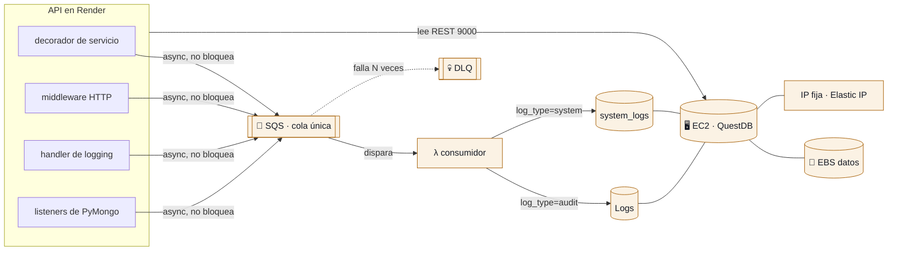

# Infraestructura de Logs (QuestDB) — Terraform

Módulo **independiente** que provisiona en AWS todo lo necesario para el logging
con **QuestDB**. No comparte estado ni recursos con el módulo de rotación
(`../rotation`): cada uno tiene su propio `terraform/` y su propio estado.



**Flujo de escritura:** la API **no** escribe directo en QuestDB; encola el log en
SQS (async, no bloquea la petición). Una **Lambda consumidora** se dispara con los
mensajes de la cola y hace el `INSERT` por el protocolo Postgres-wire (8812). La
API sí **lee** por REST (9000).

Las tres categorías comparten **una sola cola**; el campo `log_type` del mensaje
decide la tabla de destino. Se hizo así para no triplicar Lambda, rol IAM y event
source mapping por un volumen de eventos que es bajo.

## Qué se registra y dónde

| Categoría | Responde | Tabla | Productor |
|-----------|----------|-------|-----------|
| **Auditoría** | ¿Quién hizo qué, sobre qué, y con qué resultado? | `Logs` | `api/app/core/logging.py` |
| **Sistema** | ¿Qué componente interno falló? | `system_logs` (`source=system`) | `api/app/core/system_logging.py` |
| **Base de datos** | ¿Falló una operación de Mongo, y por qué? | `system_logs` (`source=mongo`) | `api/app/db/mongo_monitoring.py` |

La auditoría va aparte porque responde a otra pregunta: registra **actos de
usuario**, no defectos del software. Mezclarlas dejaría la revisión de accesos
sepultada bajo trazas de excepción.

Las dos últimas comparten tabla justamente por lo contrario: ambas responden *qué
se rompió*, y su valor está en leerlas como **un solo flujo ordenado por tiempo**.
Cuando Mongo se cae y con él revienta el arranque de la API, los dos eventos son
correlativos y quieres verlos seguidos.

Ambas tablas tienen columna `request_id`: **cruza una fila de auditoría con su
causa técnica** en la misma petición.

```sql
-- por qué le falló al usuario esa operación
SELECT l.action, l.error_message, s.source, s.message
FROM Logs l JOIN system_logs s ON l.request_id = s.request_id
WHERE l.level = 'ERROR';
```

## Qué crea

| Recurso | Función |
|---------|---------|
| **EC2** (Amazon Linux 2023) | Corre QuestDB en Docker (`user_data`) |
| **EBS (gp3)** | Volumen persistente para los datos de logs |
| **Elastic IP** | IP pública **fija** → va en `EC2_INSTANCE_IP` de la API |
| **Security Group** | Abre 9000 (REST/web) y 8812 (PG); 9009 (ILP) cerrado. Un CIDR por puerto, ver "Acceso por puerto" |
| **SQS + DLQ** | Ingesta asíncrona de logs |
| **Lambda consumidora** | Lee SQS y hace `INSERT` en `Logs` o `system_logs` según `log_type` |

## Estructura

```
logs/
├── README.md
├── .gitignore
├── lambda/
│   └── consumer/
│       ├── handler.py        # SQS -> INSERT (enruta por log_type)
│       └── requirements.txt  # pg8000
├── terraform/
│   ├── main.tf               # EC2, EBS, EIP, SG, SQS
│   ├── consumer.tf           # Lambda consumidora + IAM + event source mapping
│   ├── variables.tf
│   ├── outputs.tf
│   └── terraform.tfvars.example
└── scripts/
    ├── questdb_userdata.sh   # instala Docker + arranca QuestDB + crea/migra tablas
    └── build_consumer.sh     # empaqueta la Lambda consumidora (zip)
```

## Uso

```bash
cd tek-secrets/logs

# 1. Empaquetar la Lambda consumidora (genera terraform/lambda_consumer.zip)
./scripts/build_consumer.sh

# 2. Aplicar Terraform
cd terraform
cp terraform.tfvars.example terraform.tfvars   # editar valores
terraform init
terraform apply
```

> El `apply` necesita el zip. Corre `build_consumer.sh` **antes** de `terraform apply`
> (y de nuevo si cambias `handler.py`).

Al terminar:

```bash
terraform output questdb_public_ip     # → EC2_INSTANCE_IP de la API
terraform output questdb_web_console   # http://<ip>:9000
terraform output logs_sqs_queue_url    # → SQS_QUEUE_URL de la API
```

Luego, en las variables de entorno de la API (Render), apunta:
```
EC2_INSTANCE_PORT = 9000
SQS_QUEUE_URL     = <logs_sqs_queue_url>
# EC2_INSTANCE_IP se puede omitir: la API la autodescubre (ver más abajo)
```

## Lambda consumidora (SQS → QuestDB)

`terraform/consumer.tf` despliega una Lambda (`handler.py`, runtime `python3.12`)
disparada por la cola SQS de logs. Por cada mensaje hace `INSERT` en QuestDB usando
**pg8000** por el puerto **8812** (Postgres-wire), conectándose a la **Elastic IP**
de la EC2.

- **Enrutado:** el campo `log_type` del mensaje elige la tabla — `system` va a
  `system_logs`, cualquier otro valor (o su ausencia) va a `Logs`. El caso por
  defecto es deliberado: los mensajes encolados antes de existir el campo siguen
  llegando a su tabla original.
- **Lotes + reintentos:** procesa hasta `consumer_batch_size` mensajes por
  invocación. Usa `ReportBatchItemFailures`: solo los mensajes que fallan vuelven a
  la cola (tras `sqs_max_receive_count` reintentos van a la DLQ).
- **Credenciales QuestDB:** por defecto `admin` / `quest` / db `qdb`
  (`questdb_pg_*` en las variables). Ojo: esa variable solo le dice a la Lambda qué
  password usar; **no configura QuestDB**. Cambiarla sin tocar también el
  `docker run` del `user_data` rompe la ingesta.
- ⚠️ **SQL literal, no parametrizado:** QuestDB por PG-wire **ignora en silencio**
  los INSERT parametrizados (reporta éxito y la fila no persiste). Por eso el
  handler arma el `INSERT` como texto y escapa las comillas simples. Con mensajes
  de error y tracebacks entrando en la tabla, ese escape es lo único que impide que
  un stack trace corrompa la sentencia.
- ⚠️ **Red:** la Lambda corre **fuera de VPC**, así que sale por IPs públicas
  dinámicas de AWS y llega a QuestDB por su **IP pública**. Por eso el 8812 tiene su
  propia variable, `lambda_cidr`, y se queda en `0.0.0.0/0`: si lo restringes a la IP
  de la API, **la Lambda dejaría de conectar** (habría que meterla en la VPC con NAT —
  fuera del alcance de este módulo).

## Acceso por puerto (Security Group)

Los tres puertos tienen consumidores distintos, así que cada uno lleva su propia
variable. **No se pueden restringir por igual.**

| Puerto | Variable | Quién lo usa | Estado |
|--------|----------|--------------|--------|
| 9000 REST/consola | `api_cidr` | La API (lee logs, escribe `encryption_key_audit`) y tú desde el navegador | ⚠️ **abierto a internet** |
| 8812 Postgres-wire | `lambda_cidr` | Solo la Lambda consumidora | abierto (obligado, ver arriba) |
| 9009 ILP | `enable_ilp` | Nadie | cerrado (`false`) |

### ⚠️ Pendiente: cerrar el 9000

QuestDB OSS **no autentica el puerto 9000** — el RBAC es feature de Enterprise. Con
`api_cidr = ["0.0.0.0/0"]`, cualquiera en internet puede abrir la consola web, leer
la tabla `Logs` completa (user ids, acciones, target ids, paths) y ejecutar SQL
arbitrario, `DROP TABLE` incluido. El CIDR es la única barrera que hay.

Para cerrarlo hacen falta dos datos:

1. **IPs de egress de Render** — dashboard → tu servicio → *Connect* → *Outbound IPs*
2. **Tu IP pública** — `curl ifconfig.me` (para poder entrar a la consola)

Y luego, en `terraform.tfvars`:

```hcl
api_cidr = [
  "A.B.C.D/32",   # egress Render #1
  "A.B.C.E/32",   # egress Render #2
  "TU.IP.PUB/32", # tu máquina, para la consola web
]
```

```bash
terraform apply    # solo modifica el Security Group: no recrea la EC2 ni pierde datos
```

> Si el ISP te rota la IP pública, pierdes el acceso a la consola hasta reaplicar
> con la nueva. Las IPs de egress estáticas de Render requieren plan de pago.

## Tablas de QuestDB (DDL)

Una QuestDB fresca arranca **vacía**. El `user_data` crea las tablas de forma
idempotente. Si necesitas correrlas a mano (consola web en `:9000` o `/exec`):

```sql
-- Auditoría: actos de usuario CON su resultado (éxitos y fallos)
CREATE TABLE IF NOT EXISTS Logs (
  date TIMESTAMP, user STRING, action STRING, targetType STRING,
  idTarget STRING, details STRING, execution_time DOUBLE,
  level SYMBOL, status_code INT, error_type STRING, error_message STRING,
  client_ip STRING, user_agent STRING, method SYMBOL, request_id STRING
) TIMESTAMP(date) PARTITION BY DAY;

-- Fallos internos: los que NO producen respuesta HTTP
CREATE TABLE IF NOT EXISTS system_logs (
  date TIMESTAMP, level SYMBOL, source SYMBOL, logger STRING,
  message STRING, error_type STRING,
  operation STRING, collection STRING, duration_ms DOUBLE,
  request_id STRING
) TIMESTAMP(date) PARTITION BY DAY;

-- Auditoría de rotación de llaves (INSERT directo desde la API)
CREATE TABLE IF NOT EXISTS encryption_key_audit (
  timestamp TIMESTAMP, action STRING, key_id STRING, project_id STRING,
  actor_id STRING, ip_address STRING, operation_result STRING, details STRING
) TIMESTAMP(timestamp) PARTITION BY DAY;
```

Notas de esquema:

- `level` es `SYMBOL` (no `STRING`): es el tipo que QuestDB usa para valores
  repetidos de baja cardinalidad, los guarda como diccionario y filtra más rápido.
- En `system_logs`, `operation` / `collection` / `duration_ms` solo se llenan con
  `source='mongo'`. Van null en el resto y no cuesta nada: QuestDB es columnar.
- Las filas de `Logs` **anteriores** a la columna `level` la tienen null. Eran todas
  éxitos, así que el filtro de INFO las incluye con `(level='INFO' OR level IS NULL)`.

> `encryption_key_audit` **debe existir** antes de rotar (la API le hace `INSERT`
> directo; QuestDB no auto-crea tablas con `INSERT`, solo con ILP).

### Evolución del esquema (añadir columnas)

`CREATE TABLE IF NOT EXISTS` **no** añade columnas si la tabla ya existe. Como el
EBS sobrevive a la recreación de la instancia, un `user_data` nuevo se encontraría
con la tabla vieja y no la actualizaría.

Por eso el script lanza, después de cada `CREATE`, un bucle de
`ALTER TABLE ... ADD COLUMN` ignorando el error de "la columna ya existe". Así el
mismo script produce el esquema correcto tanto sobre un volumen vacío como sobre
uno con datos de una versión anterior.

**Al añadir una columna nueva hay que tocar tres sitios**, y en este orden:

1. `scripts/questdb_userdata.sh` — el `CREATE` y el bucle de `ALTER`
2. `lambda/consumer/handler.py` — la sentencia `INSERT`
3. La instancia viva — o recreándola, o lanzando el `ALTER` a mano (ver abajo)

> ⚠️ El orden importa: si despliegas la Lambda **antes** de que la columna exista,
> cada `INSERT` falla y todos los mensajes acaban en la DLQ.

### Ojo: cambiar el `user_data` NO re-ejecuta el script

Terraform aplica el cambio **in-place** (`update in-place`, no recrea la instancia),
pero `cloud-init` solo corre en el primer arranque. O sea: el script queda
actualizado para el próximo despliegue desde cero, pero **la instancia en marcha
sigue con el esquema viejo**. Dos formas de alinearla:

```bash
# A) Recrear la EC2: el user_data corre de nuevo y aplica los ALTER solo.
#    El EBS y la EIP sobreviven; hay unos minutos de downtime.
terraform apply -replace=aws_instance.questdb
```

```bash
# B) Lanzar el ALTER a mano contra la instancia viva (instantáneo, sin downtime).
IP=$(terraform output -raw questdb_public_ip)
curl -s -G "http://$IP:9000/exec" --data-urlencode "query=ALTER TABLE Logs ADD COLUMN mi_columna STRING;"
```

La opción A tiene una ventaja: **valida el `user_data` de extremo a extremo**. Si
solo usas B, el script queda sin probar y te enteras de si funciona el día que
recrees la infra, que es justo cuando no quieres sorpresas.

## Autodescubrimiento desde la API (sin poner la IP a mano)

La API descubre la IP de QuestDB **sola**, al arrancar: busca en AWS la instancia
EC2 con tag `Name = tek-secrets-questdb` (la que crea este módulo) y toma su IP
pública. Implementado en `api/app/core/config.py` (`_discover_questdb_ip`).

- Si `EC2_INSTANCE_IP` **está** en las env vars de la API → esa tiene prioridad.
- Si **no está** → se autodescubre desde AWS. Así, aunque destruyas y recrees la
  QuestDB (IP nueva), la API la vuelve a encontrar al reiniciar, sin cambios manuales.

**Requisitos:**
- La API ya usa `boto3` y credenciales AWS (las de SQS). El usuario de esas
  credenciales necesita el permiso IAM **`ec2:DescribeInstances`**.
- El nombre del tag es configurable con la env var `QUESTDB_INSTANCE_NAME`
  (default `tek-secrets-questdb`).

## Imagen base (AMI): por qué el filtro es tan específico

`main.tf` resuelve la AMI con `most_recent = true` y un filtro por nombre. El
patrón **tiene que ser** `al2023-ami-2023.*-x86_64`, no `al2023-ami-*-x86_64`.

Con el patrón laxo entran también las variantes especializadas (`minimal`, `ecs`,
`ecs-neuron`). En una ocasión `most_recent` resolvió a `al2023-ami-ecs-neuron-*`
—la imagen para chips Inferentia/Trainium, con root de 30 GB— y el apply falló:

```
InvalidBlockDeviceMapping: Volume of size 20GB is smaller than snapshot, expect size >= 30GB
```

El patrón acotado excluye esas variantes porque ninguna empieza por `2023.` justo
detrás del prefijo. Aun así, `most_recent` es frágil por naturaleza: si quieres
reproducibilidad estricta, fija `ami_id` en `terraform.tfvars` — esa variable tiene
prioridad sobre el `data source`.

## ⚠️ A diferencia de la rotación (serverless)

- **Con estado y siempre encendido:** la EC2 factura 24/7 (es el costo real de este
  módulo, a diferencia de la rotación que cuesta centavos).
- **Cuidado con `terraform destroy`:** elimina la EC2. Los datos sobreviven solo si
  el volumen EBS no se borra; considera *snapshots* (backup) antes de destruir.
- **Restringe el acceso:** ver "Acceso por puerto". Cada puerto tiene su propia
  variable; no se pueden restringir por igual.

## Ciclo de vida: parar / eliminar / recrear

Gracias al **volumen EBS** (datos persistentes) y al **autodescubrimiento** de la
API, puedes apagar, borrar y recrear la QuestDB sin romper nada.

### Parar (pausar) — deja de facturar cómputo, conserva los datos

```bash
cd tek-secrets/logs/terraform
ID=$(terraform output -raw questdb_instance_id)

aws ec2 stop-instances  --instance-ids "$ID"   # pausar
aws ec2 start-instances --instance-ids "$ID"   # reanudar
```

- La **Elastic IP no se libera** → al reanudar la IP es **la misma**; la API no
  necesita re-descubrir nada.
- Parada solo pagas el EBS (y la EIP mientras no esté asociada a instancia encendida).

### Eliminar todo

```bash
# (opcional) snapshot del EBS antes de borrar, para no perder los logs históricos
cd tek-secrets/logs/terraform
VOL=$(terraform state show aws_ebs_volume.questdb_data | grep -m1 'id ' | awk '{print $3}' | tr -d '"')
aws ec2 create-snapshot --volume-id "$VOL" --description "questdb-logs backup"

terraform destroy      # ⚠️ borra EC2 + EBS (los datos se pierden sin snapshot)
```

### Recrear

```bash
cd tek-secrets/logs
./scripts/build_consumer.sh          # regenera el zip de la Lambda
cd terraform
terraform apply                      # levanta todo de cero; user_data recrea las tablas
```

- El `user_data` recrea las tablas (`CREATE TABLE IF NOT EXISTS` + los `ALTER`) y la
  Lambda consumidora queda apuntando a la EIP nueva (Terraform lo cablea).
- La EIP es **nueva** → **reinicia la API** para que autodescubra la IP:
  ```bash
  cd tek-secrets/api && .venv/bin/fastapi dev app/main.py
  ```

> El nombre del dispositivo EBS varía (`/dev/xvdf` vs `/dev/nvme1n1` en instancias
> Nitro); el script `questdb_userdata.sh` detecta automáticamente el que exista.

## Comandos rápidos (build · deploy · consultar · pausar · eliminar)

```bash
# ── BUILD (empaquetar la Lambda consumidora) ───────────────
cd /Users/delta27222/Desktop/tesis/tek-secrets/logs
./scripts/build_consumer.sh    # genera terraform/lambda_consumer.zip (pg8000)

# ── DEPLOY (crear/actualizar en AWS) ───────────────────────
cd terraform
terraform init
terraform apply

# ── CONSULTAR ──────────────────────────────────────────────
IP=$(terraform output -raw questdb_public_ip)

# auditoría: últimos fallos, con quién y desde dónde
curl -s -G "http://$IP:9000/exec" --data-urlencode \
  "query=SELECT date, \"user\", action, status_code, error_message, client_ip, user_agent FROM Logs WHERE level='ERROR' ORDER BY date DESC LIMIT 20;"

# sistema: fallos internos por módulo
curl -s -G "http://$IP:9000/exec" --data-urlencode \
  "query=SELECT date, level, source, logger, message, error_type FROM system_logs ORDER BY date DESC LIMIT 20;"

# base de datos: solo lo que reportó el driver de Mongo
curl -s -G "http://$IP:9000/exec" --data-urlencode \
  "query=SELECT date, operation, collection, duration_ms, message FROM system_logs WHERE source='mongo' ORDER BY date DESC LIMIT 20;"

# qué tablas y columnas hay ahora mismo
curl -s -G "http://$IP:9000/exec" --data-urlencode "query=SHOW TABLES;"
curl -s -G "http://$IP:9000/exec" --data-urlencode "query=SHOW COLUMNS FROM Logs;"

# logs de la propia Lambda (ver si algo se está yendo a la DLQ)
aws logs tail /aws/lambda/tek-secrets-questdb-consumer --region us-east-1 --since 5m

# ── PAUSAR (Stop EC2 — deja de facturar cómputo, conserva datos) ──
ID=$(terraform output -raw questdb_instance_id)
aws ec2 stop-instances  --instance-ids "$ID" --region us-east-1
# Reanudar (la Elastic IP no cambia):
aws ec2 start-instances --instance-ids "$ID" --region us-east-1

# ── ELIMINAR (borra todo lo de AWS) ────────────────────────
cd /Users/delta27222/Desktop/tesis/tek-secrets/logs/terraform
terraform destroy
# Solo un recurso:
terraform destroy -target=aws_lambda_function.consumer
```

| Acción | Efecto | Recursos | Datos |
|--------|--------|----------|-------|
| `stop-instances` | pausa la EC2 | siguen creados | conservados (EBS) |
| `start-instances` | reanuda la EC2 | — | misma IP (EIP) |
| `terraform destroy` | borra todo | eliminados | ⚠️ se pierden sin snapshot |

> ⚠️ A diferencia de la rotación (serverless, `$0` en reposo), aquí un `stop` deja de
> facturar cómputo pero **sigues pagando el EBS y la EIP**. Solo `terraform destroy`
> lleva el costo a cero (y borra los datos).

## Diagnóstico: no llegan logs

| Síntoma | Dónde mirar |
|---------|-------------|
| Nada llega a ninguna tabla | `SQS_QUEUE_URL` y credenciales AWS en la API. Sin ellas `send_log_to_sqs` avisa y descarta |
| Mensajes en la DLQ | Casi siempre una columna que la Lambda escribe y la tabla no tiene. `SHOW COLUMNS` y compara con `handler.py` |
| Llega la auditoría pero no los de sistema | ¿Existe `system_logs`? El `user_data` viejo no la creaba |
| Faltan errores que sí ves en la consola de la API | El nivel mínimo es `WARNING`, y hay enfriamiento de 60s por mensaje repetido más un tope de 60/min (`api/app/core/system_logging.py`) |
| Un logger no aparece nunca | Puede estar en `EXCLUDED_LOGGERS`: los de SQS y boto se excluyen a propósito para no entrar en bucle |
| La consola web no responde | `api_cidr` en el SG, y que la EC2 no esté parada |
