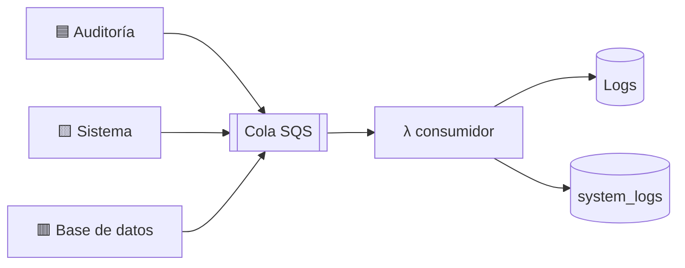

# Recorrido guiado del subsistema de logs

Guion para presentar el sistema abriendo los archivos en orden. Cada paso es una
línea con su enlace: haces clic, muestras, explicas.

- [README.md](README.md) → cómo desplegarlo y operarlo.
- `sprint4/sprint4_desarrollo_logs.md` → el detalle completo, para el documento escrito.
- **Este** → para explicarlo en voz alta.

---

## El sistema en 30 segundos

> Registramos tres cosas distintas. La primera responde *quién hizo qué* — eso es
> auditoría. Las otras dos responden *qué se rompió*.
>
> Ninguna se escribe directo en la base de datos de logs: las tres pasan por una
> cola, y una función serverless las inserta después. Así registrar nunca frena ni
> tumba lo que se está registrando.



| | Categoría | Responde | Tabla |
|---|---|---|---|
| 🟦 | **Auditoría** | ¿Quién hizo qué, y funcionó? | `Logs` |
| 🟨 | **Sistema** | ¿Qué componente falló? | `system_logs` · `source='system'` |
| 🟥 | **Base de datos** | ¿Falló Mongo, y por qué? | `system_logs` · `source='mongo'` |

Las tres comparten cola. Se separan al final, por un campo `log_type` en el mensaje.

---

# 🟦 Flujo 1 — Logs de auditoría

**Ejemplo:** un usuario lee los secretos de un ambiente.

| # | Qué pasa | Archivo |
|---|----------|---------|
| 1 | La operación está marcada con un decorador — **una sola línea** | [membership.py:50](../api/app/api/v1/endpoints/membership.py#L50) |
| 2 | El decorador resuelve usuario y recurso, ejecuta la operación y mide el tiempo | [logging.py:362](../api/app/core/logging.py#L362) |
| 3 | El middleware guarda la petición en una variable de contexto y genera un id de correlación | [logging.py:140](../api/app/core/logging.py#L140) |
| 4 | Arma el mensaje y lo manda a la cola **sin bloquear** | [logging.py:55](../api/app/core/logging.py#L55) |
| 5 | Se publica en SQS | [sqs.py:24](../api/app/services/sqs.py#L24) |
| 6 | AWS dispara la Lambda con un lote de mensajes | [consumer.tf:79](terraform/consumer.tf#L79) |
| 7 | La Lambda inserta en `Logs` | [handler.py:142](lambda/consumer/handler.py#L142) |

Y para leerlos, camino aparte:

| # | Qué pasa | Archivo |
|---|----------|---------|
| 8 | La API consulta QuestDB por HTTP con un constructor de consultas | [questdb_orm.py:102](../api/app/core/questdb_orm.py#L102) |
| 9 | El endpoint entrega filtrado y paginado | [endpoints/logs.py:13](../api/app/api/v1/endpoints/logs.py#L13) |
| 10 | La interfaz los pinta, con pestañas Info / Errores | [page.tsx:47](../../tek-secrets-app/app/organizations/[id]/page.tsx#L47) |

### Las 3 cosas que explicar aquí

**Por qué el decorador y no llamadas sueltas.** Auditar una operación nueva es
anotarla y ya. No hay líneas de registro repartidas por la lógica de negocio.

**Por qué una variable de contexto.** Las funciones de servicio no reciben el objeto
de la petición, por diseño. La variable de contexto se la hace llegar sin pasarla como
parámetro por todas las capas, y cada petición ve la suya aunque haya cientos a la vez.

**Por qué hay una cola en medio.** Sin ella, la base de datos de logs sería una
dependencia crítica: si va lenta, la API va lenta; si cae, la API cae. El componente
que existe para observar el sistema podría tumbarlo.

---

# 🟦 Flujo 2 — Cuando la operación falla

Sigue siendo auditoría: son actos de usuario que **no prosperaron**. Misma tabla
`Logs`, con `level='ERROR'`.

> Esto es lo que añadimos en este sprint. Antes la tabla **solo tenía éxitos**: un
> intento denegado de leer un secreto ajeno no dejaba ningún rastro.

| # | Qué pasa | Archivo |
|---|----------|---------|
| 1 | Si falla dentro de un servicio marcado, el decorador lo audita antes de relanzar | [logging.py:333](../api/app/core/logging.py#L333) |
| 2 | Si falla antes de llegar ahí (401, 404), lo recoge el middleware | [logging.py:140](../api/app/core/logging.py#L140) |
| 3 | Se lee el cuerpo de la respuesta para sacar el **motivo real**, no solo el código | [logging.py:101](../api/app/core/logging.py#L101) |
| 4 | El usuario se recupera del `scope`, donde lo dejó la autenticación | [auth.py:18](../api/app/core/auth.py#L18) |
| 5 | De ahí en adelante, igual que el flujo 1: cola → Lambda → `Logs` | — |

### Las 2 cosas que explicar aquí

**Un 403 no llega como excepción.** FastAPI lo convierte en respuesta antes de que
el middleware lo vea. Por eso se detecta mirando el código de estado de la respuesta,
no capturando excepciones.

**Sin leer el cuerpo, todos los 401 son iguales.** "Falta el token" y "el token es
inválido" darían la misma fila. El motivo viaja en el cuerpo, así que se lee y se
reconstruye la respuesta. Solo si es error y solo si es JSON — las descargas no se
tocan.

---

# 🟨 Flujo 3 — Logs de sistema

**Qué registra:** fallos internos que **nunca llegan a ser respuesta HTTP**.

El caso que lo justifica:

```python
# services/environment.py:90
except Exception as e:
    logger.error(f"Error decrypting field: {e}")
    return None          # ← se traga el error: no hay 500, no hay auditoría
```

> Un fallo al descifrar un secreto era completamente invisible. Solo se veía en la
> consola, que se pierde en cada despliegue.

| # | Qué pasa | Archivo |
|---|----------|---------|
| 1 | Alguien hace `logger.error(...)` en cualquier módulo | [environment.py:90](../api/app/services/environment.py#L90) |
| 2 | El registro sube al logger raíz, donde estamos enganchados | [system_logging.py:223](../api/app/core/system_logging.py#L223) |
| 3 | Se deposita en una cola **en memoria** y ahí termina el trabajo de la petición | [system_logging.py:206](../api/app/core/system_logging.py#L206) |
| 4 | Un hilo aparte lo saca, lo filtra y lo manda a SQS | [system_logging.py:116](../api/app/core/system_logging.py#L116) |
| 5 | La Lambda lo inserta en `system_logs` | [handler.py:78](lambda/consumer/handler.py#L78) |

### Las 3 cosas que explicar aquí

**Hay dos colas, no una.** La de memoria evita que quien registra espere a la red.
La de AWS evita que la API dependa de QuestDB. Misma idea, dos niveles.

**El anti-bucle.** Si el envío a SQS falla, el módulo de SQS registra un error… que
intentaría enviarse a SQS. Recursión infinita. Se corta excluyendo esos loggers por
nombre — [system_logging.py:48](../api/app/core/system_logging.py#L48).

**El anti-inundación.** Si una dependencia cae, cada petición repite el mismo error.
Hay enfriamiento de 60s por mensaje y tope de 60/minuto. En pruebas, 51 mensajes
idénticos produjeron **un solo envío** — [system_logging.py:63](../api/app/core/system_logging.py#L63).

### Y una anécdota que vale más que la explicación

> Durante el desarrollo la API dejó de arrancar. En la tabla quedó la secuencia
> completa: timeout de Mongo → fallo del cifrado → aborto del servidor, con traza y
> tipo de excepción. Antes eso habría desaparecido con el contenedor.
>
> Además los registros mostraban que se recuperó **solo**, lo que descartó un bloqueo
> de red y apuntó a un clúster despertando de suspensión.

---

# 🟥 Flujo 4 — Logs de base de datos

**Qué registra:** los fallos que reporta el driver de Mongo.

| # | Qué pasa | Archivo |
|---|----------|---------|
| 1 | Se registran dos *listeners* al crear el cliente | [mongodb_utils.py:31](../api/app/db/mongodb_utils.py#L31) |
| 2 | Uno captura los comandos que fallan (`find`, `update`…) | [mongo_monitoring.py:32](../api/app/db/mongo_monitoring.py#L32) |
| 3 | Otro captura los nodos que dejan de responder | [mongo_monitoring.py:83](../api/app/db/mongo_monitoring.py#L83) |
| 4 | Emiten por el logger normal → reutilizan el flujo 3 completo | — |
| 5 | Acaban en `system_logs` con `source='mongo'` | — |

### Las 2 cosas que explicar aquí

**La decisión más importante del subsistema.** El evento del driver trae el
**documento completo del comando**: valores de secretos, filtros, credenciales.
Guardarlo convertiría la tabla de logs en un segundo almacén de secretos sin cifrar.

Se extrae **solo el nombre de la colección**. Hay una prueba que falla si alguien
relajara eso.

**Por qué dos listeners y no uno.** Si Mongo está *inalcanzable* no se llega a enviar
ningún comando, así que no hay comando que falle. Ese es justo el fallo que nos tumbó
el arranque. El segundo listener lo cubre.

---

## Cómo se cruzan las dos tablas

Ambas tienen `request_id`. Una dice *que falló*, la otra *por qué*:

```sql
SELECT l.action, l.error_message, s.source, s.message
FROM Logs l JOIN system_logs s ON l.request_id = s.request_id
WHERE l.level = 'ERROR';
```

---

# ⬜ Flujo 5 — La infraestructura

Todo se crea y se destruye con un comando. Nada se hizo a mano.

| Qué | Archivo |
|-----|---------|
| Máquina, disco, IP fija, cortafuegos, cola | [main.tf:46](terraform/main.tf#L46) |
| La función consumidora y sus permisos | [consumer.tf:54](terraform/consumer.tf#L54) |
| Quién puede entrar por cada puerto | [variables.tf:66](terraform/variables.tf#L66) |
| Instalación y creación de tablas al arrancar | [questdb_userdata.sh:58](scripts/questdb_userdata.sh#L58) |

### Las 2 cosas que explicar aquí

**Un CIDR por puerto, no uno para todos.** El puerto de lectura se puede acotar; el
de escritura **no**, porque la Lambda corre fuera de la red privada y sale por IPs
que AWS asigna dinámicamente. Restringirlo cortaría la ingesta.

**Crear no es migrar.** `CREATE TABLE IF NOT EXISTS` no añade columnas si la tabla ya
existe, y el disco sobrevive a recrear la máquina. Por eso hay un bucle de `ALTER`
detrás — [questdb_userdata.sh:66](scripts/questdb_userdata.sh#L66).

---

# Demo en vivo

```bash
cd tek-secrets/logs/terraform && IP=$(terraform output -raw questdb_public_ip)
```

**1. Las tablas existen**

```bash
curl -s -G "http://$IP:9000/exec" --data-urlencode "query=SHOW TABLES;"
```

**2. Provocar un error y verlo aparecer** — con la API corriendo:

```bash
curl -i http://localhost:8000/v1/me
```

```bash
curl -s -G "http://$IP:9000/exec" --data-urlencode "query=SELECT date, action, status_code, error_message, client_ip FROM Logs WHERE level='ERROR' ORDER BY date DESC LIMIT 3;"
```

> Aquí se ve el motivo textual, no solo el código.

**3. El mismo 401 con dos motivos distintos**

```bash
curl -i -H "X-GitHub-Token: token-invalido" http://localhost:8000/v1/me
```

**4. Los logs de sistema**

```bash
curl -s -G "http://$IP:9000/exec" --data-urlencode "query=SELECT date, level, source, logger, message FROM system_logs ORDER BY date DESC LIMIT 10;"
```

**5. En la interfaz** — organización → Logs → alternar Info / Errores. Las columnas
cambian entre una y otra.

---

# Preguntas probables

**¿Por qué no guardarlos en MongoDB?** Son cargas distintas: los logs son un flujo de
solo escritura que se consulta por fecha, que es justo el patrón de una base de series
de tiempo. Y separarlo evita que un pico de registros afecte al servicio.

**¿Y si se cae la base de logs?** Nada visible. Los mensajes esperan en la cola. La
API no se entera porque nunca escribe directo.

**¿Y si se pierde un mensaje?** SQS reintenta. Tras varios fallos va a una cola
aparte para inspección, sin bloquear a los demás.

**¿No es riesgoso guardar tanto?** Hay tres exclusiones deliberadas: no se guardan
parámetros de consulta, ni cuerpos de petición, ni documentos de comandos de Mongo.
Es donde viven los valores sensibles.

**¿Cuánto cuesta?** Entre 18 y 20 dólares al mes, casi todo la máquina encendida y su
disco. La cola y la función son marginales.

**¿Qué queda pendiente?** Tres cosas, documentadas en la sección 4.4.14 del capítulo:
QuestDB en su versión libre no autentica el puerto de lectura, el contenedor usa las
credenciales por defecto, y los errores 5xx están en la tabla de auditoría cuando
conceptualmente pertenecen a la de sistema.

---

# Chuleta

**🟦 Auditoría** → tabla `Logs`

| Qué | Archivo |
|---|---|
| Marcar una operación | [membership.py:50](../api/app/api/v1/endpoints/membership.py#L50) |
| El decorador | [logging.py:362](../api/app/core/logging.py#L362) |
| Auditar el fallo | [logging.py:333](../api/app/core/logging.py#L333) |
| Leer el motivo del cuerpo | [logging.py:101](../api/app/core/logging.py#L101) |

**🟨 Sistema** → `system_logs` con `source='system'`

| Qué | Archivo |
|---|---|
| El fallo invisible | [environment.py:90](../api/app/services/environment.py#L90) |
| El enganche al logger raíz | [system_logging.py:223](../api/app/core/system_logging.py#L223) |
| Anti-bucle | [system_logging.py:48](../api/app/core/system_logging.py#L48) |
| Anti-inundación | [system_logging.py:63](../api/app/core/system_logging.py#L63) |

**🟥 Base de datos** → `system_logs` con `source='mongo'`

| Qué | Archivo |
|---|---|
| Solo el nombre de la colección | [mongo_monitoring.py:32](../api/app/db/mongo_monitoring.py#L32) |
| Nodo que no responde | [mongo_monitoring.py:83](../api/app/db/mongo_monitoring.py#L83) |

**⬜ Común a las tres**

| Qué | Archivo |
|---|---|
| El reparto por `log_type` | [handler.py:78](lambda/consumer/handler.py#L78) |
| Acceso por puerto | [variables.tf:66](terraform/variables.tf#L66) |
| Crear no es migrar | [questdb_userdata.sh:66](scripts/questdb_userdata.sh#L66) |
