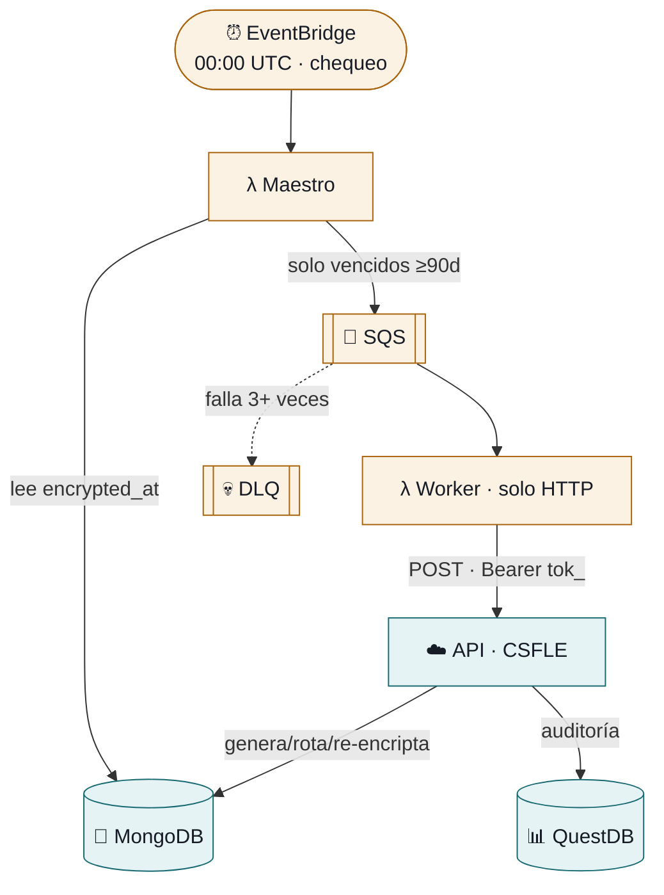

# Rotación automática de llaves (AWS + API)

Rota la llave de encriptación de **cada proyecto** y re-encripta sus secretos
**cuando su llave cumple 90 días** (configurable). Un cron diario revisa qué
proyectos vencieron; AWS orquesta y encola; la **API** ejecuta la criptografía
(CSFLE). Los Lambdas **no** manejan encriptación. Ver [¿cuándo rota?](#operación--cuándo-rota).



> Diagrama interactivo/exportable (PNG/SVG/PDF): ver el Artifact de arquitectura.
> Detalle profundo: [`docs/ARCHITECTURE.md`](./docs/ARCHITECTURE.md) ·
> [`docs/LAMBDA_REFERENCE.md`](./docs/LAMBDA_REFERENCE.md) ·
> [`docs/DEPLOYMENT_GUIDE.md`](./docs/DEPLOYMENT_GUIDE.md).

---

## Estructura

```
rotation/
├── README.md                 # este archivo (paso a paso)
├── lambda/
│   ├── rotation_master.py    # lista proyectos → SQS  (usa motor)
│   └── rotation_worker.py    # POST a la API          (solo stdlib)
├── terraform/
│   ├── main.tf               # SQS, Lambdas, EventBridge, IAM, CloudWatch
│   ├── variables.tf
│   ├── outputs.tf
│   └── terraform.tfvars.example
├── scripts/
│   ├── build_master.sh                 # build Maestro (Docker)
│   ├── build_worker.sh                 # build Worker (zip)
│   ├── relax_service_token_validator.py # relaja validador Mongo (1 vez)
│   └── migrate_csfle_keys.py            # (legacy) migración CSFLE
└── docs/                     # documentación profunda
```

---

## Requisitos

- AWS CLI v2 configurado (`aws sts get-caller-identity` funciona)
- Terraform ≥ 1.0
- Docker (solo para el build del Maestro)
- Python 3.12 (para los scripts helper)
- La **API desplegada en Render** (ver Paso 1)

---

## Paso a paso

### Paso 1 · API en Render (una vez)

La API es la que hace la rotación con CSFLE. Debe estar desplegada y sana.

1. Deploy del repo `api/` en Render como **Web Service**:
   - Build: `pip install -r requirements.txt`
   - Start: `uvicorn app.main:app --host 0.0.0.0 --port $PORT`
   - **Python 3.12** pinneado: `api/.python-version` + env `PYTHON_VERSION=3.12.13`
     (Python 3.14 rompe `pydantic-core`/`pymongocrypt`)
   - `requirements.txt` debe usar `pymongo[encryption]` (trae `pymongocrypt`)
2. **Env vars** en Render:
   ```
   MONGODB_URL              = mongodb+srv://...
   MONGO_DB                 = secrets-27222
   MONGODB_CSFLE_MASTER_KEY = <EL MISMO valor que encriptó las llaves existentes>
   GITHUB_CLIENT_ID         = ...
   GITHUB_CLIENT_SECRET     = ...
   SECRET_KEY               = ...
   ```
   > ⚠️ `MONGODB_CSFLE_MASTER_KEY` debe ser **idéntica** a la del `.env` local que creó
   > las llaves; si no, la API no podrá desencriptar lo existente.
3. **MongoDB Atlas → Network Access → `0.0.0.0/0`** (Render usa IPs dinámicas).
4. Verifica que la API arranca sin el error de `pymongocrypt`.

### Paso 2 · Relajar el validador de `service_tokens` (una vez)

Los tokens de sistema van con `project_id = null`; el validador de Mongo debe aceptarlo.

```bash
cd tek-secrets/rotation
python3 scripts/relax_service_token_validator.py \
  --mongodb-url "mongodb+srv://..." \
  --db secrets-27222
```
Debe imprimir `project_id` → `["objectId","null"]`.

### Paso 3 · Crear el service token (una vez)

En la app web: **Organización → tab Tokens → Crear Token**
- Scope: **`keys:rotate`**
- Copia el `tok_...` (se muestra **una sola vez**)

> Solo owners/admins de una organización pueden crear tokens de sistema.

### Paso 4 · Configurar `terraform.tfvars`

```bash
cd tek-secrets/rotation/terraform
cp terraform.tfvars.example terraform.tfvars
```
Edita `terraform.tfvars` y completa:
```hcl
mongodb_url        = "mongodb+srv://...        # para el Maestro
api_base_url       = "https://tu-app.onrender.com"
rotation_api_token = "tok_...                   # el del Paso 3
```
> `terraform.tfvars` está en `.gitignore` — no se commitea.

### Paso 5 · Build de los Lambdas

```bash
cd tek-secrets/rotation
./scripts/build_master.sh     # Docker → terraform/lambda_master.zip
./scripts/build_worker.sh     # zip    → terraform/lambda_worker.zip (~4.6 KB)
```

### Paso 6 · Deploy con Terraform

```bash
cd tek-secrets/rotation/terraform
terraform init
terraform apply
```
Crea: SQS (+ DLQ), 2 Lambdas, EventBridge (cron), IAM roles, CloudWatch logs.

### Paso 7 · Probar

```bash
# Disparar manualmente el Maestro
aws lambda invoke --function-name tek-secrets-rotation-master \
  --region us-east-1 /tmp/r.json && cat /tmp/r.json

# Ver logs del Worker (debe mostrar POST + 200)
aws logs tail /aws/lambda/tek-secrets-rotation-worker --region us-east-1 --since 2m
```
Logs esperados del Worker:
```
📨 Procesando proyecto: <id>
📡 POST https://tu-app.onrender.com/v1/internal/projects/<id>/rotate-encryption
✅ API respondió 200: {"status":"success","environments_processed":3,...}
```
En MongoDB: nueva `encryption_keys` **activa** (metadata completa, `key_material`
Binary CSFLE) y cada `environments.secrets_encryption.encrypted_with_key_id`
apuntando a la nueva llave.

---

## Operación · ¿cuándo rota?

Hay **dos ritmos distintos**:

| Parámetro | Qué controla | Default |
|-----------|--------------|---------|
| `rotation_schedule` | cada cuánto el Maestro **revisa** (cron) | diario 00:00 UTC |
| `rotation_interval_days` | cada cuánto una llave realmente **rota** | 90 días |

**Cómo decide el Maestro qué rotar** (no rota todo cada día):
1. Por cada proyecto, mira el `secrets_encryption.encrypted_at` **más reciente**
   entre sus environments (= última vez que se rotó).
2. Si esa fecha ya pasó `rotation_interval_days` (90), el proyecto **está vencido** →
   lo encola. Si nunca se rotó, también entra. Si no, se salta.
3. Solo los vencidos van a SQS → API → rotación.

Resultado: el cron es un “reloj de chequeo” diario; cada proyecto rota ~cada 90 días
(escalonado según cuándo se creó/rotó por última vez).

- Cambiar el intervalo: `rotation_interval_days = 30` → `terraform apply`.
- Cambiar la frecuencia de chequeo: `rotation_schedule` → `terraform apply`.
  - `cron(0 0 ? * MON *)` lunes · `cron(0 */6 * * ? *)` cada 6h · `cron(0 0 1 * ? *)` mensual.

> Tras cambiar el **código** del Maestro hay que reconstruir su zip:
> `./scripts/build_master.sh` (requiere Docker) y luego `terraform apply`.

## Eliminar / pausar (evitar costos)

```bash
cd tek-secrets/rotation/terraform
terraform destroy                       # borra TODO lo de AWS
# o pausar solo el cron sin destruir:
aws events disable-rule --name tek-secrets-rotation-schedule --region us-east-1
```

## Costos

~$1–1.5 USD/mes para <100 proyectos (Lambda + SQS + CloudWatch + EventBridge).

---

## Troubleshooting (lo que ya resolvimos)

| Síntoma | Causa | Solución |
|---------|-------|----------|
| Worker `API error HTTP 401` | token inválido / sin scope | recrear token (Paso 3) y `terraform apply` |
| Worker `HTTP 500` con "CSFLE" | `MONGODB_CSFLE_MASTER_KEY` en Render distinta a la local | igualarla (Paso 1.2) |
| Worker `No se pudo conectar a la API` | URL mala o Render dormido | verificar `api_base_url`; el cold start lo cubre `HTTP_TIMEOUT=300s` |
| `Document failed validation` al crear token | validador exige `project_id` objectId | correr `relax_service_token_validator.py` (Paso 2) |
| API en Render no compila (`pydantic-core`/Rust) | Render usó Python 3.14 | pinnear 3.12 (`.python-version` + `PYTHON_VERSION`) |
| API arranca y crashea con `pymongocrypt` | `requirements.txt` sin `[encryption]` | usar `pymongo[encryption]` |
| Maestro `ConnectionFailure` a Mongo | IP no permitida en Atlas | whitelist `0.0.0.0/0` |
| SQS mensajes en DLQ | Worker falló 3+ veces | ver logs, corregir, purgar DLQ |

---

## Notas de arquitectura

- **Por qué la API y no el Lambda**: CSFLE requiere `pymongocrypt`/`libmongocrypt`
  (binarios) que no corren bien en Lambda. La API en Render (Linux + Python 3.12) sí.
- **Auth Lambda→API**: service token de sistema (global, `project_id=null`) con scope
  `keys:rotate`. El Worker envía `Authorization: Bearer tok_...`.
- **El Worker no tiene dependencias** (solo `urllib`/`json`) → ZIP mínimo.

---

## Comandos rápidos (build · deploy · pausar · eliminar)

```bash
# ── BUILD (empaquetar Lambdas) ─────────────────────────────
cd /Users/delta27222/Desktop/tesis/tek-secrets/rotation
./scripts/build_master.sh      # Maestro (necesita Docker)
./scripts/build_worker.sh      # Worker (solo stdlib)

# ── DEPLOY (crear/actualizar en AWS) ───────────────────────
cd terraform
terraform init
terraform apply

# ── PROBAR (disparo manual + logs) ─────────────────────────
aws lambda invoke --function-name tek-secrets-rotation-master \
  --region us-east-1 /tmp/r.json && cat /tmp/r.json
aws logs tail /aws/lambda/tek-secrets-rotation-worker --region us-east-1 --since 2m

# ── PAUSAR (sin destruir — $0 de ejecución) ────────────────
aws events disable-rule --name tek-secrets-rotation-schedule --region us-east-1
# Reactivar:
aws events enable-rule  --name tek-secrets-rotation-schedule --region us-east-1

# ── ELIMINAR (borra todo lo de AWS) ────────────────────────
cd /Users/delta27222/Desktop/tesis/tek-secrets/rotation/terraform
terraform destroy
# Solo un recurso:
terraform destroy -target=aws_lambda_function.rotation_worker
```

| Acción | Efecto | Recursos | Costo |
|--------|--------|----------|-------|
| `disable-rule` | pausa el cron | siguen creados | $0 ejecución |
| `enable-rule` | reanuda el cron | — | — |
| `terraform destroy` | borra todo | eliminados | $0 total |
