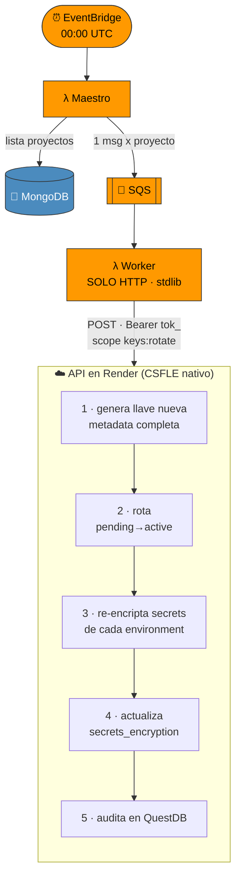

# 📋 Resumen de Solución: Rotación de Llaves con AWS + API (CSFLE)

**Arquitectura final**: El Lambda Worker **delega** la rotación a la API en Render,
que ejecuta todo con su CSFLE nativo. Los Lambdas NO manejan encriptación.

---

## El Problema (evolución)

### Intento 1 — Lambda hace todo con `cryptography`
```
[ERROR] Runtime.ImportModuleError: .../cryptography/hazmat/bindings/_rust.abi3.so:
        invalid ELF header
```
`cryptography` se compiló en macOS; Lambda corre Linux x86_64 → binarios incompatibles.

### Intento 2 — Lambda con `pyaes` (pure Python)
Funcionó el import, pero **no replicaba el CSFLE de la API**. Las llaves quedaban
con `key_material` visible (Binary sin cifrar) y sin la metadata completa.

### Intento 3 — Lambda con `pymongo[encryption]` (CSFLE)
```
pymongo.errors.ConfigurationError: client-side field level encryption requires
the pymongocrypt library
```
CSFLE necesita `pymongocrypt` + `libmongocrypt` (binarios nativos) que **no corren
en Lambda** de forma sencilla.

---

## La Solución Final

**Mover toda la lógica criptográfica a la API** (que ya tiene CSFLE) y dejar al
Lambda Worker como un simple disparador HTTP.



### Por qué funciona
| Antes | Ahora |
|-------|-------|
| Lambda intenta CSFLE (falla) | API en Render hace CSFLE (Linux + Python 3.12 + `pymongocrypt`) |
| Lambda con `motor` + `pyaes` + `pymongo` | Lambda solo `urllib` + `json` (stdlib) |
| `key_material` visible / sin metadata | Igual que la API: Binary CSFLE + metadata completa |
| `secrets_encryption` no se actualizaba | La API lo actualiza en cada environment |

---

## Componentes

| Componente | Rol | Tecnología |
|------------|-----|-----------|
| **EventBridge** | Cron 00:00 UTC | AWS |
| **Lambda Maestro** | Lista proyectos → SQS | Python 3.12 + Motor |
| **SQS** | Cola (un mensaje por proyecto) | AWS SQS |
| **Lambda Worker** | HTTP POST a la API | Python 3.12 (solo stdlib) |
| **API (Render)** | Genera/rota llave + re-encripta (CSFLE) | FastAPI + pymongo[encryption] |
| **Service token** | Autentica Lambda→API | `tok_...` scope `keys:rotate` |

---

## Autenticación: Service Token de Sistema

El Lambda no puede hacer OAuth de GitHub. Se usa un **service token de sistema**
(global, sin proyecto) con scope `keys:rotate`:

- Se crea desde la UI: **Organización → tab Tokens → Crear Token**
- Autorización: solo owners/admins de una organización (rol real en BD)
- El endpoint de rotación exige `Authorization: Bearer tok_...` + scope `keys:rotate`
- El `tok_...` se guarda en `terraform.tfvars` → `rotation_api_token`
  (Terraform lo inyecta como env var `ROTATION_API_TOKEN` del Worker)

---

## Validación (logs esperados del Worker)

```
[INFO] 🚀 Inicio - SQS Event
[INFO] Records: 1
[INFO] 📨 Procesando proyecto: 6a5328df09826f5f1909d8db
[INFO] 📡 POST https://<api>/v1/internal/projects/6a5328df.../rotate-encryption
[INFO] ✅ API respondió 200: {"status":"success","environments_processed":3,...}
[INFO] ✅ Proyecto 6a5328df...: success (3 OK, 0 fallos)
```

En MongoDB, tras la rotación:
- Nueva `encryption_keys` **activa** con metadata completa y `key_material` Binary (CSFLE)
- Cada `environments.secrets_encryption.encrypted_with_key_id` apunta a la nueva llave

---

## Notas de despliegue (Render)

- La API debe correr con **Python 3.12** (pinneado vía `api/.python-version` +
  env var `PYTHON_VERSION=3.12.13`) — Python 3.14 rompe la compilación de
  `pydantic-core`/`pymongocrypt`.
- `requirements.txt` usa `pymongo[encryption]` (trae `pymongocrypt`).
- Env vars mínimas en Render: `MONGODB_URL`, `MONGO_DB`, `MONGODB_CSFLE_MASTER_KEY`
  (el MISMO valor que encriptó las llaves existentes), + credenciales GitHub OAuth.
- MongoDB Atlas: whitelist `0.0.0.0/0` (Render usa IPs dinámicas).
- Validador de `service_tokens`: `project_id` debe aceptar `["objectId","null"]`
  para permitir tokens de sistema (ver `relax_service_token_validator.py`).

---

**Status**: ✅ **PRODUCCIÓN LISTA**
